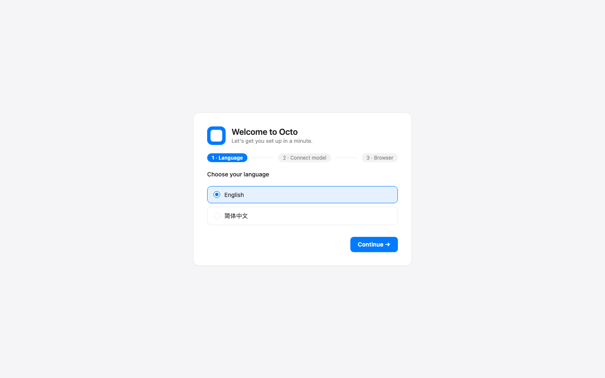
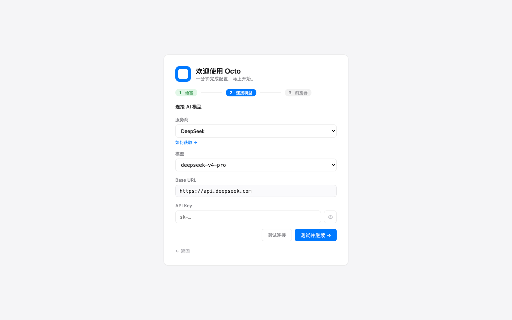
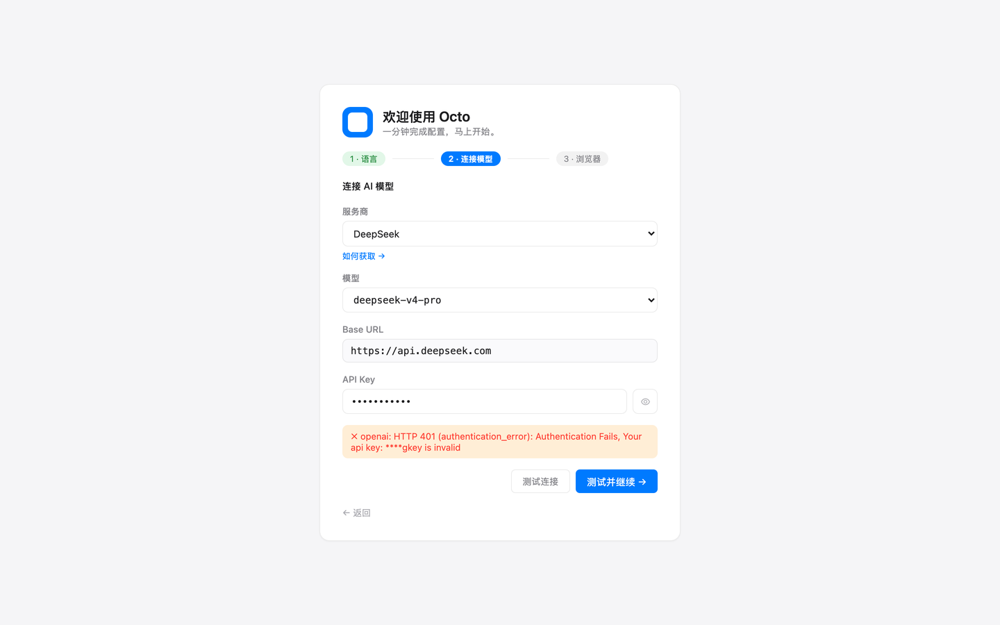
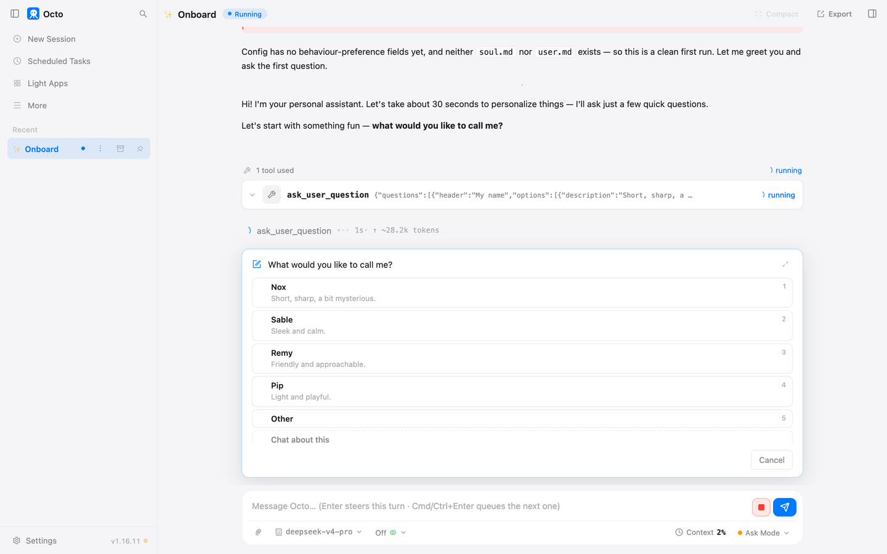
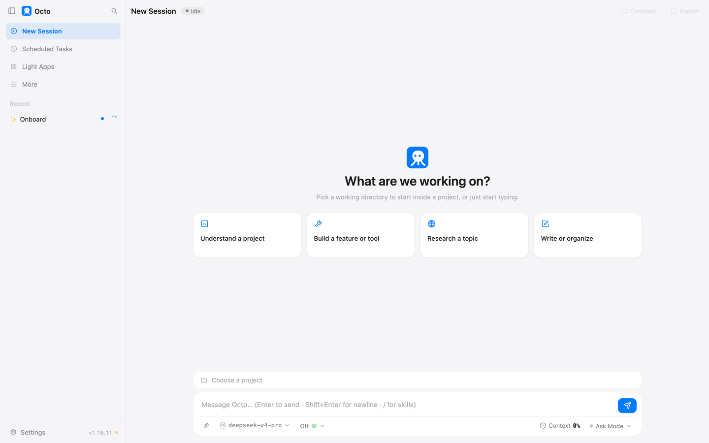
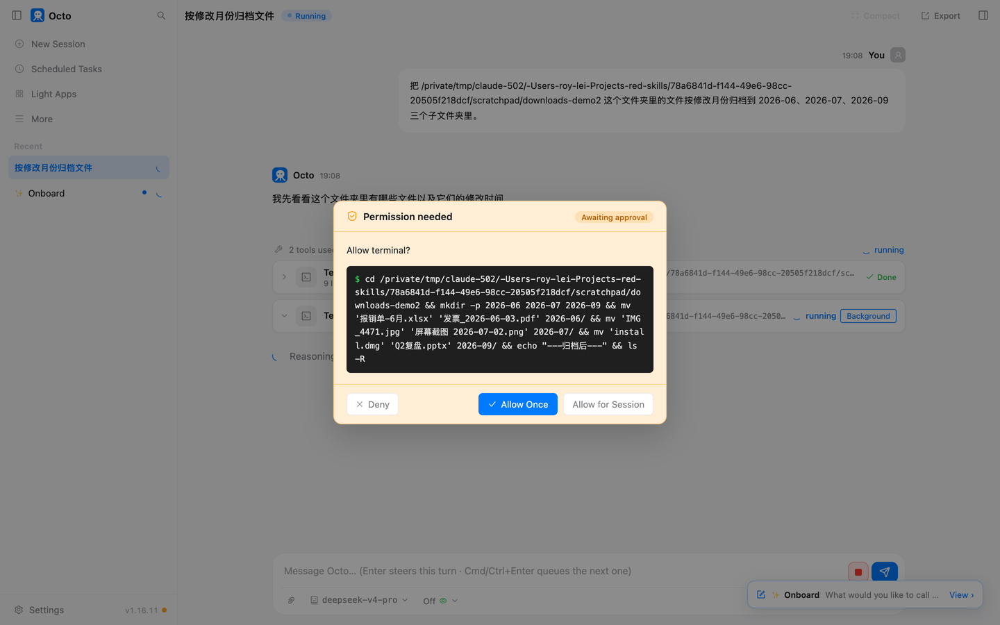
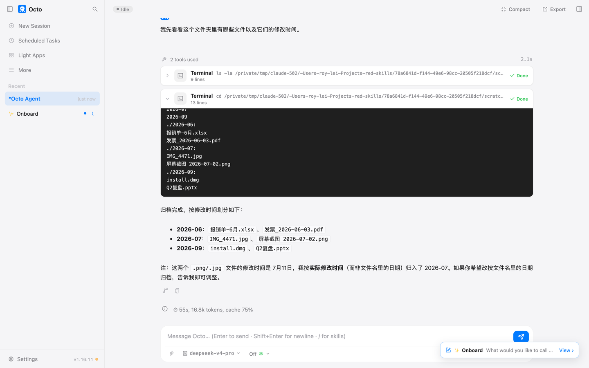

# 第 1 章 装好，说上第一句话

这一章的目标只有一个：三十分钟内，让它替你干成第一件小事。装的过程有几个地方会拦你一下，
我把每一个都写在最后，撞到了直接翻过去看。

## 准备什么

- 一台 Mac 或 Windows 电脑。
- 一个模型服务商的账号。这本书全程用 DeepSeek，便宜，人民币充值，先充 10 块钱够你把 Part 0 和 Part 1 前几章全部做完。
  去它官网注册，进"API keys"页面新建一个 key，复制下来放着。key 长得像一串以 sk- 开头的乱码，
  别发给任何人，它等于你的钱包。
- 一个乱文件夹。你的"下载"文件夹多半就是。

## 装

### Mac

打开 octo 的 GitHub 发布页，下载 `octo-setup.pkg`，双击。

安装器只有"仅为我安装"一个选项，不要管理员密码。装完它会把 Octo 装进你的应用程序文件夹，
顺手把命令行版也装上，然后自动打开一个窗口。

第一次打开多半会被系统拦下，提示"来自身份不明的开发者"。这是因为安装包还没做苹果的公证，
不是文件有问题。右键点应用图标选"打开"，或者到系统设置的"隐私与安全性"里点"仍要打开"，
之后就不会再问。

### Windows

下载 `octo-setup.exe`，双击。按用户装，不弹管理员提示，装完开始菜单里多一项 Octo，窗口自动打开。

SmartScreen 会说"Windows 已保护你的电脑"。点"更多信息"，再点"仍要运行"。原因同上，安装包没签名。

### 下载不动

GitHub 在你的网络下打不开的话，用镜像：把地址里的 github 那一段换成 `dl.octo-agent.dev`，
其余一样。安装脚本和以后的升级也会自动退到这个镜像。

## 第一次打开：三步

窗口打开是一个引导页，三步。



**第一步，选语言。** 选简体中文。

**第二步，连接模型。** 服务商下拉里有十几家，选 DeepSeek。选完之后模型和地址两栏会自动填好，
你只需要把 key 贴进最后一栏。旁边有个"如何获取"的链接，忘了 key 在哪申请就点它。



贴完先点"测试连接"，别急着继续。key 贴错的话，它会当场告诉你：



看到那行红字，多半是复制的时候少了头尾几个字符，或者账户还没充值。回去重新复制一遍。
测试通过再点"测试并继续"。

**第三步，浏览器。** 这一步是可选的，让它以后能操作你的浏览器。现在点"以后再说"，第 10 章再回来开。


## 它先跟你聊两句

引导结束，它会自己开一个对话，先问你想叫它什么名字，再让你选一个性格。



这不是花架子。它会把你的回答写进一个文件，以后每次对话都带着。你现在随便选一个，
第 7 章讲记忆的时候会回来改。

聊完点左上角"New Session"，进入正式的界面。



认一下地方就行，不用记：左边一列是会话列表、定时任务、轻应用和设置；中间是对话；
最下面输入框旁边能看到当前用的模型，右下角"Ask Mode"的意思是它动手前会问你。
这些后面章节用到再说。

## 第一件小事

把你的下载文件夹路径准备好。Mac 上在访达里右键文件夹，按住 Option 键，菜单里有"拷贝路径"；
Windows 上在资源管理器地址栏点一下，复制。

我的原话是这样的，你把路径换成你的：

> 把 /Users/我/Downloads 这个文件夹里的文件按修改月份归档到 2026-06、2026-07、2026-09 三个子文件夹里。

发出去，看它做什么。

它先看了一眼文件夹里有什么，然后弹出一个框停下来了：



框里写的是它准备执行的命令，建三个文件夹、把文件挪进去。三个按钮：拒绝、允许一次、本次会话都允许。
**点"允许一次"。** 每一次它要动你的文件都会这样停下来，这是你这本书里要保住的最重要的习惯。
"本次会话都允许"是给你完全信得过的活用的，现在不用。

点了之后它接着干完，把结果列给你：



它还多说了一句：两张截图文件名里的日期是 7 月 2 日，修改时间是 7 月 11 日，它按修改时间归的，
你要按文件名的日期它可以改。这种主动交代是好事，说明它知道哪里有歧义。

最后一行是这一单的开销：55 秒，1.7 万 token。折成钱看你选的模型单价，第 2 章末尾教你去服务商后台看账单。
这一单在 DeepSeek 上是几分钱的量级。

## 你如果说漏了

我第一次说的时候漏了一个月份，只说了 6 月、7 月、8 月，但文件夹里有 9 月的文件。它没有自作主张，
停下来问了我：

```
[ask_user_question · 9月文件]
  install.dmg 和 Q2复盘.pptx 的修改时间是 2026年9月，不在你指定的三个月份里，要如何处理？
    1) 保留在原处不动
    2) 也建个 2026-09 文件夹放入
    3) Other (free text)
```

我没回答，它就一个文件都没动，还追问了一句归档是按修改时间还是按文件名里的日期。

记住这个场面。第 2 章整章讲的就是怎么把话说清楚，让它少停下来问，以及哪些地方你反而希望它停下来问。

## 你要重点检查什么

- 归档完，原文件夹里除了新建的子文件夹不该剩别的文件。剩了，说明有文件它拿不准归哪里，看它的回复里有没有说。
- 文件数量对不对。归档前后各数一遍。
- 它有没有动你没提的文件。这一单没有，因为你给的是一个具体路径。以后每次都看一眼弹出的命令框，里面写的路径是不是你说的那个。

## 翻车点

- **文件夹路径给错了。** 它会告诉你找不到，不会乱猜一个。重新复制路径。
- **它建的文件夹名和你说的不一样。** 比如你说"六月"它建了"2026-06"。这是你没说清楚格式，下次原话里写明。
- **点了"本次会话都允许"之后它连着做了好几步你没看清。** 新开一个会话就回到每步都问。

## 风险提醒

第一件小事选整理文件夹，是因为它最坏的结果也就是文件被挪错了地方，而且 octo 删除和覆盖文件之前会先备份到自己的回收站，
第 17 章教你找回来。**这一章不要拿工作文件夹练手。** 先在下载文件夹或者一个你拷贝出来的副本上跑。

## 常见安装问题

- **Mac 说"来自身份不明的开发者"，打不开。** 右键应用图标选"打开"；或者系统设置的隐私与安全性里，往下找到"仍要打开"。只需要做一次。
- **Windows 说"Windows 已保护你的电脑"。** 点"更多信息"，再点"仍要运行"。
- **下载不动。** 换镜像地址，见上面"下载不动"。
- **测试连接报 401。** key 复制不全，或者账户没充值。到服务商后台重新复制一遍，确认余额。
- **测试连接一直转圈。** 你的网络到服务商不通。先在浏览器里打开服务商官网试试。
- **装完想在终端里用，敲 octo 说找不到命令。** 关掉终端重新开一个窗口。
- **窗口打开是白的或者一直加载。** 关掉重开一次。还不行的话，本机 8088 端口可能被别的程序占了，第 17 章有排查办法。

## 花了多少

- 装：Mac 上从下载到引导结束大约五分钟，取决于网速。
- 第一件小事：55 秒，1.7 万 token。

## 上册对照

上册练习 9 和练习 10 亲手写过那个弹出来问你的闸门。你刚点的"允许一次"，就是它。

*最后核对：2026-09-02，octo 1.16.11。*

