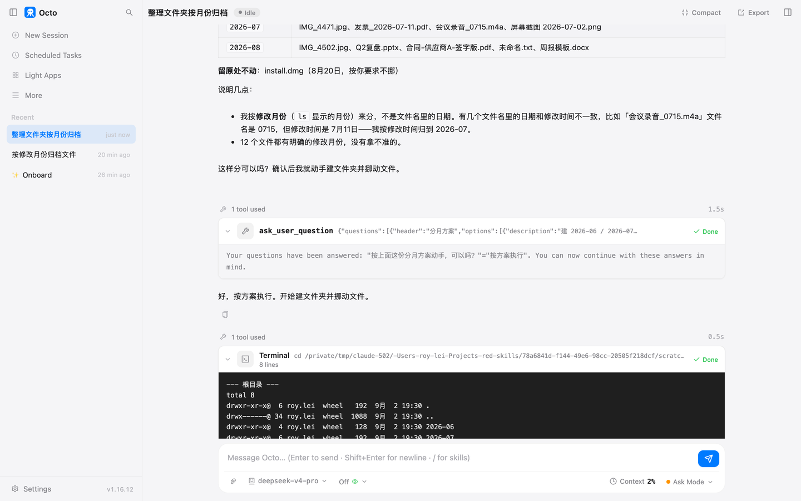
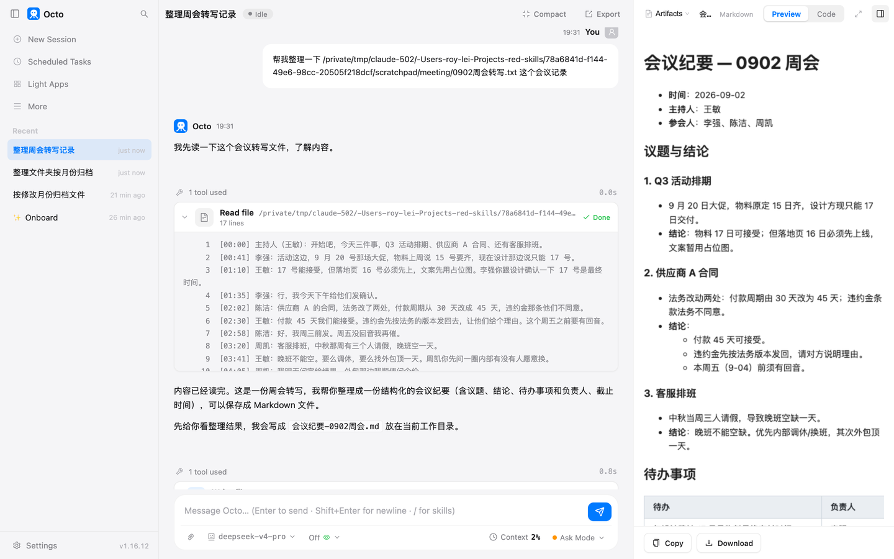
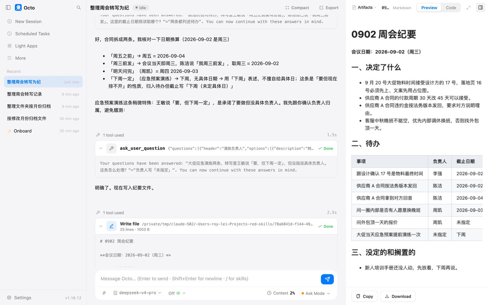

# 第 2 章 把活说清楚

第 1 章末尾那一幕：我少说了一个月份，它停下来问我。这一章把那一幕拆开讲。

它干不好一个活，十次里有八次是没听清，不是不会。你给新同事交代事情会说到的那几点，
对它一样要说。说全了，它一次做对；说漏了，它要么停下来问你，要么自己拿主意，后者更麻烦。

## 六个要素

一句完整的交代，包含六个部分。不用每次都写全，但缺哪一个，你要知道自己缺了什么。

1. **要处理的是什么。** 哪个文件夹、哪个文件、哪段文字。给路径，别说"那个"。
2. **想要的结果长什么样。** 文件夹按什么分、纪要分几节、表格有哪几列、文件叫什么名字放哪里。
3. **哪些别碰。** 不要重命名、不要删、这个文件留在原处、不要加原文里没有的内容。
4. **做到什么程度算完。** 根目录只剩子文件夹；表里每行都有负责人。一句能核对的话。
5. **做不完怎么办。** 拿不准的留在原处，最后列给我；听不出负责人的写"未指定"，别猜。
6. **哪一步要问我。** 动手前把方案给我看一次；只要有一处拿不准就先问。

前四条是给它的，后两条是给你自己留的退路。下面三个活，每个都用两种说法各跑一次，
你看差别。

## 实验一：整理文件夹

第 1 章那个乱文件夹的副本，12 个文件。

**模糊的说法**：

> 帮我整理一下这个文件夹

它看了一眼文件夹，没动手，问了我一个问题：

```
[ask_user_question · 整理方式]
  希望按什么方式整理这些文件？
    1) 按文件类型分类（推荐）
    2) 按用途/主题分类
    3) 按日期分类
    4) 只重命名规范化
```

这是好的表现，它没有替你决定"整理"是什么意思。但你已经多花了一轮。它还把文件数数成了 13 个，
实际是 12 个。这种小错在模糊的活里更容易出现，因为它自己也不确定该盯什么。

**清楚的说法**，六个要素都在：

> 整理这个文件夹。要处理的：里面的 12 个文件。想要的结果：按文件的修改月份建子文件夹，名字用 2026-06 这种格式，把文件挪进去。别碰的：不要重命名任何文件，不要删除任何文件，install.dmg 留在原处不动。算做完：文件夹根目录只剩月份子文件夹和 install.dmg。做不完怎么办：哪个文件拿不准归哪个月，留在原处，最后列给我。要问我的：动手前把你准备怎么分的方案先列出来问我一次。

它先读了文件的修改时间，列了一张分月方案表，说明了"会议录音_0715 文件名是 0715 但修改时间是 7 月 11 日，我按修改时间归"，
然后停下来问我"这样分可以吗"。我点了"按方案执行"，它弹出权限框，我点"允许一次"，它挪完文件，
又自己列了一遍三个子文件夹的内容核对，最后报告：



> 根目录现在只剩三个月份子文件夹和 install.dmg，符合你要求的结果。所有 12 个文件都按修改月份归位，没有重命名、没有删除，install.dmg 留在原处不动。没有拿不准归哪个月的文件。

它复述的正是你交代里的第 3 条和第 4 条。你写了"算做完"的标准，它就拿这个标准自查。

## 实验二：会议纪要

一段 16 行的周会转写，三个议题，几条待办，一件搁置的事。

**模糊的说法**：

> 帮我整理一下这个会议记录

它一口气做完了，没问：



结果不差。议题、结论、待办表都有，负责人和时间也对。但有三处是它替你定的：
格式是它选的；文件存到了它自己的工作目录里，不在转写文件旁边；末尾多了一段"风险提示"，
说应急预案演练拖到大促前有执行风险。这段话转写里没有人说过。

**清楚的说法**：

> 把这个转写文件整理成会议纪要。要处理的：这个转写文件，会议日期是 2026-09-02（周三）。想要的结果：在同一个文件夹里新建 0902周会纪要.md，只有三节：一、决定了什么（每条一句话）；二、待办（表格，列：事项、负责人、截止日期，截止日期换算成具体日期）；三、没定的和搁置的。别碰的：不要改动原转写文件；纪要里不要出现转写里没说过的内容，不要加建议和风险提示。算做完：文件写好，待办表里每一行都有负责人。做不完怎么办：哪条待办听不出负责人或截止时间，负责人一栏写"未指定"，别猜。要问我的：只要有一处拿不准就先问我，不要自己定。

它读完转写，问了两个问题。第一个：

> 陈洁的合同待办，转写里王敏说「周五之前要有回音」，陈洁自己说「我周三前发」。这里的截止日期我该取哪个？
> 1) 周五（2026-09-04） 2) 周三（2026-09-02，即当天） 3) 两条都列进待办

我选了"两条都列进待办"。第二个：

> 大促应急演练，转写里王敏说「要，但下周一定」，但没指派具体负责人。这条怎么处理？
> 1) 负责人写「未指定」 2) 归入「搁置」

我选了"未指定"。然后它写了文件，弹权限框，我允许，它报告完成：



写出来的文件就是三节，待办表六行，每行都有负责人，两行写着"未指定"，没有风险提示。
这两个问题都是转写里真实存在的歧义，模糊版没问，直接替你选了。

## 实验三：写一封催合同的邮件

这个活没有文件，全靠说。

> 帮我给供应商 A 写一封邮件，催他们回复合同。背景：我们法务把付款周期改成 45 天、违约金条款按我们版本，合同已经发给他们，需要他们周五（9 月 4 日）前回复。要求：中文，200 字以内，客气但截止日期要明确；不要承诺任何合同条款的让步；不要编造对方联系人的名字和我们公司的名字，这两处用【】留空。写好直接给我看，不用存文件。有拿不准的先问我。

它先问了两点：开头称呼怎么写，落款要不要留空。我回了一句"称呼写【收件人称呼】，落款写【我方公司/签发部门】"。
它给了一封 180 字的邮件，截止日期明确，没有让步，两处留空。


但有一处它编了。正文里写"经多次沟通，目前尚未收到贵方反馈"。背景里没有"多次沟通"这回事，合同只发过一次。
这是"别碰的"那一条没写够：我写了不要编名字，没写不要编事实。下次这一条要写成"不要加背景里没有的事实"。

## 发生了什么

**它不是懒，是没边界就自己定。** 三个模糊版里，它一次问了、两次直接做了。直接做的两次结果都能用，
但格式、位置、多出来的内容都是它定的。你没说的地方，它一定会替你填上一个答案。

**"算做完"这一条，它会拿来自查。** 实验一它挪完文件又核了一遍三个子文件夹，然后逐条复述你的要求。
你不写这一条，它做完就走。

**"要问我的"控制它问多少。** 实验二清楚版我写了"只要有一处拿不准就先问"，它问了两次，
整个过程花了七分多钟，大部分是我在回答。模糊版一次没问，十七秒做完。问多问少没有对错，
看这个活错了的代价。纪要发给一屋子人，错一个截止日期要改一圈，值得多问两句；
一封给自己看的草稿，让它直接写。

**"别碰的"要写到事实层面。** 邮件那次它编了"多次沟通"。不要编名字、不要编数字、不要加背景里没有的事，
这三句话以后每次都带上。

**六要素写起来很长。** 实验二的清楚版一百多字。同一个活每周都要交代一遍的话，第 8 章教你把这段话写进一个文件，
以后一句话触发。这一章先把话说明白，那一章再让它不用重复说。

## 你要重点检查什么

- 输出在不在你说的位置。模糊版会存到它自己的目录里，Artifacts 面板能预览，但你下次找不到。
- 有没有它编的内容。对着原材料看一遍，尤其是数字、日期、"多次""已经"这类词。
- "算做完"那一条它有没有复述。没复述，多半是没做到。

## 翻车点

- **文件数数错。** 模糊版说 13 个，实际 12 个。你说了具体数字它就会去对。
- **日期的歧义它会替你选。** "周三前发"在周三当天开的会，模糊版直接写成了周三，没告诉你这里有歧义。
- **它会用"经多次沟通"这类套话填空。** 你没给的背景，它按常见邮件的样子补。

## 风险提醒

新的活第一次交代，先在副本上跑，或者先让它"只列方案不动手"。这一章三个活里只有整理文件夹会动你的文件，
而且每次动之前都有权限框。写邮件和写纪要不会改你原来的文件，但纪要那个模糊版往它自己的目录里写了文件，
你要知道那个目录在哪，第 17 章讲。

## 花了多少

| 活 | 说法 | 时间 | token |
|---|---|---|---|
| 整理文件夹 | 清楚版，含一次确认 | 3 分 28 秒 | 1.96 万 |
| 会议纪要 | 模糊版 | 17 秒 | 1.92 万 |
| 会议纪要 | 清楚版，含两次问答 | 7 分 42 秒 | 2.01 万 |
| 邮件 | 第一轮，它问我 | 4 秒 | 1.70 万 |
| 邮件 | 第二轮，我答它写 | 4 秒 | 310 |

时间里包含我读它的问题和点选项的时间，不全是它在算。

看最后两行。第一轮 1.7 万 token，第二轮 310。第一轮贵，是因为每场对话的第一句话它要随身带一整套说明书清单、
规则和记忆，这些内容在第二轮里被缓存了，你只为新增的那几句话付钱。所以同一个活，接着聊比新开一场便宜得多。

## 账单去哪看

octo 每一轮回复末尾有一行：耗时、token 数、缓存命中率。缓存命中率高，这一轮就便宜。

钱要到服务商后台看。DeepSeek 的用量页按天列 token 和扣费。它的定价按峰时和谷时两档，
北京时间工作日上午九点到十二点、下午两点到六点是峰时，谷时价格是峰时的一半。
写这一章的时候，deepseek-v4-pro 峰时价格是每百万 token 输入未命中缓存 9 元、命中缓存 0.3 元、输出 27 元。

拿实验二清楚版算一下：2 万 token，缓存命中 84%，按峰时价，输入那部分不到一毛钱，
加上输出的几百上千字，一单几分钱到一毛钱之间。这一章五个实验加起来不到五毛钱。
价格会变，你算的时候以后台当天的价目为准。

## 原话模板

抄下来，以后每个新活先填一遍：

```
[要做的活]。
要处理的：
想要的结果：
别碰的：不要编名字、不要编数字、不要加我没给的事实；
算做完：
做不完怎么办：拿不准的留着别动，最后列给我；
要问我的：
```

附录 A 里有按活分类的现成模板。

## 上册对照

上册练习 8 讲的是给模型写的那段"怎么用工具"的基础提示词。你在这一章每次交代里写的六个要素，是同一类内容的临时版：
每场对话现写一段。第 8 章会把它变成长期版。

*最后核对：2026-09-02，octo 1.16.12。*

