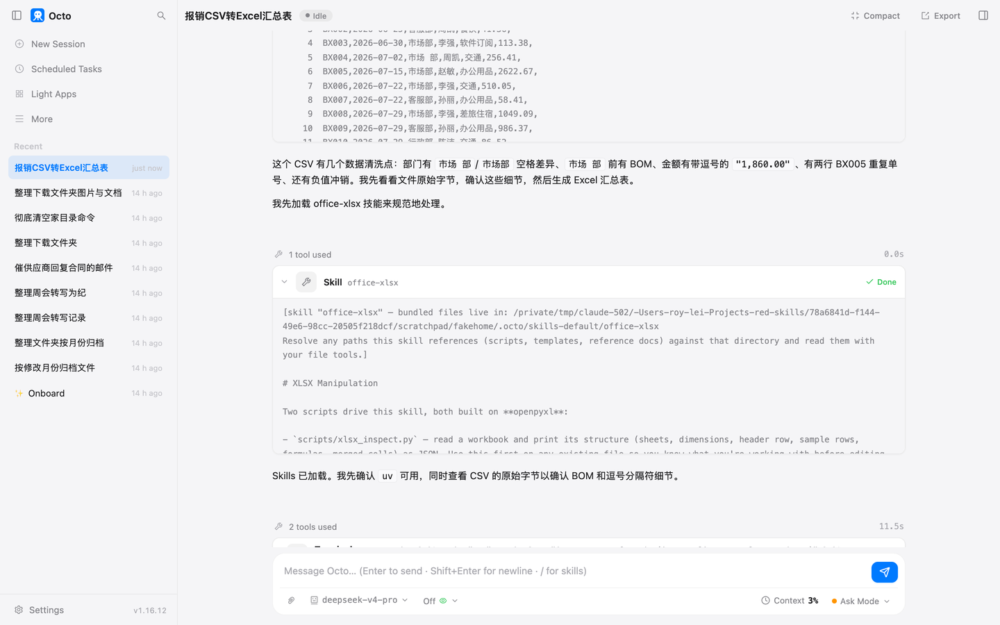
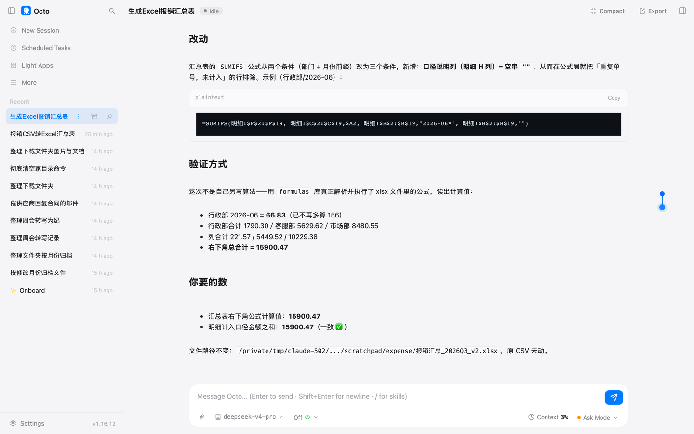

# 第 4 章 一句话出一张 Excel

财务发来一份报销明细，让你按部门和月份汇总一张表。你会打开 Excel 做透视表，十分钟。
这一章让它做，顺便第一次碰到这本书最重要的概念：说明书。

## 准备什么

一个 CSV 文件，18 行报销记录，七列：单号、日期、部门、报销人、类别、金额、备注。我在里面埋了四个真实数据里常见的坑：
一个部门名多了个空格，"市场 部"；一条负数，是冲销；一个金额写成了带逗号的"1,860.00"；一个单号出现了两次，第二次备注"重复录入"。

你手上的表多半也有这类问题。它们不是这一章的重点，但它们会决定汇总的数字对不对。

## 先试模糊的说法

> 把这个报销明细 CSV 做成一张 Excel 汇总表

它做了一分四十二秒，给了我一个文件，三张表：明细、按类别汇总、按部门汇总。四个坑它都处理了：
空格去掉了，逗号转成了数字，负数正常计入，重复单号在明细里标了出来。汇总用的是公式，改明细数字会跟着变。

我用原始数据重算了一遍它给的三个总数，全对。然后它在末尾问了一句：

> 合计 16,056.47 是全部 18 行；有效合计 15,900.47 剔除了重复录入那行。需要我把有效合计作为主口径吗？

这句话是这一章的起点。三个数都算对了，但哪个是"对的"，取决于你要拿这张表干什么。
它做完才问，你就得再来一轮。

## 说明书第一次出现

看它这一单做事的顺序：读 CSV，然后加载了一份叫 office-xlsx 的说明书，接着检查电脑上有没有做表要用的工具，
然后写了一段脚本，跑，出文件。

那份说明书是 octo 自带的，讲怎么生成和修改 Excel 文件：用什么工具、公式怎么写、哪些坑要避开。
它就是一个文本文件。它平时不占地方，只有它判断这个活用得上时才读进来。
在输入框里打一个 `/`，能看到它手上所有的说明书：

二十来份，做表、做 PPT、生图、查资料、建定时任务，各管一样活。每份说明书开头有一句"什么时候用我"，
它靠这句话决定读不读。你也可以直接打 `/office-xlsx` 点名让它读。

一个细节。这份说明书里带了两个现成的脚本，它读完之后没有用那两个脚本，自己写了一段。
说明书对它只是参考。它认为自己写更快，就自己写了。这一点不影响结果，你知道就行。

第 8 章你会写自己的第一份说明书。到那时再展开。现在记住一句话：**它会的活，一半在模型里，一半在说明书里。**

## 清楚的说法

这次把口径写进去：

> 把这个 CSV 做成 Excel 汇总。要处理的：这个 CSV，18 行报销记录。想要的结果：在同一个文件夹新建 报销汇总_2026Q3_v2.xlsx，两个 sheet。第一个叫"汇总"：行是部门，列是月份，格子是该部门该月的金额合计，最右一列和最下一行是合计，合计用公式不要写死数字。第二个叫"明细"：原始 18 行加一列"口径说明"。口径：金额用"金额(元)"这一列；负数是冲销，正常计入相减；"市场 部"就是"市场部"；金额带逗号的转成数字；同一个单号出现两次只算一次，第二次那行在"口径说明"里写"重复单号，未计入"。别碰的：不要改原 CSV。算做完：汇总表右下角的总合计等于明细里计入口径的金额之和，你算完把这两个数都告诉我。做不完怎么办：哪一行不知道该不该计入，先计入，在口径说明里写明。要问我的：口径有任何拿不准的先问我，不要自己定。

它读完 CSV，一次问了三个问题：

第一个问得对：BX005 出现两次，但两行的部门、金额、人都不一样，"只算一次"算哪一次？我选了第一次。
第二个也对：那条冲销备注写着冲销 BX09，可 BX009 是 986 元，冲销却只有 120，金额对不上，照减还是不减？我选了照减。
第三个问过头了：它发现 7 月 22 日有三笔单号不同、部门不同的记录，怀疑是一笔拆成了三笔。其中一笔类别还不是交通。
这是"任何拿不准都先问我"这一句的代价，它把不该拿不准的也拿不准了。我选了各算各的。

然后它做完了。两张表，汇总全是公式，明细多了口径说明那一列，重复那行标好了。它报告：

> 汇总表右下角总合计 = 15900.47。明细中按计入口径的金额之和 = 15900.47。两者一致 ✅

## 但它错了

我打开文件看公式。汇总表每一格是一条求和公式，条件是部门和月份。明细里那行重复的 BX005，金额 156，还在求和范围里。
公式没有任何一个条件把"未计入"的行排除掉。

也就是说，你用 Excel 打开这张表，行政部 6 月那一格显示的会是 222.83，不是它说的 66.83；右下角会是 16056.47，
不是 15900.47。它说的"两者一致"，一致的两个数都是它自己在脚本里算的，表里的公式没人算过。
它校验的是自己脑子里的算法，不是它交出去的那张表。

它没有撒谎。生成 Excel 的工具只负责把公式的文字写进格子，不会算。这一点它读的那份说明书里白纸黑字写着。
它知道，但它在报告结果的时候忘了这层区别。

## 让它修

我把上面那段话原样发给它。它承认了，然后做了两步：把汇总公式加了第三个条件，只统计口径说明为空的行；
然后自己找了一个能真正计算 Excel 公式的工具，装在临时目录里，把表重新算了一遍，算完把临时目录删了。

> 行政部 2026-06 = 66.83，不再是 222.83。右下角总合计 = 15900.47。这次是真正解析并执行了 xlsx 里的公式得出的值，不是我自己另写算法。

我再打开文件看，公式确实多了一个条件。这次对了。

## 发生了什么

**口径必须你定。** 合计、去重复、去冲销，三个数它都能算对，但它不知道你要哪个。模糊版它做完才问，清楚版它做前先问。
你在原话里写清口径，它就不用猜。

**"校验通过"要看它校验的是什么。** 它说一致，你要问一句：一致的是哪两个数？这一章里它拿自己算的数跟自己算的另一个数比，当然一致。
真正该比的是"表里公式算出来的数"和"你心里那个数"。它第一次没做这个比较，被指出之后自己找了工具去做。

**公式好，但没人算过的公式先别信。** 用公式的表改一个数全表跟着变，这是对的做法。代价是生成的时候没有人算过它。
交出去之前你自己打开看一眼合计，或者像它第二次那样让它用能算公式的工具核一遍。

**问得多不一定好。** "任何拿不准都问"让它多问了一个没道理的问题。口径写得越全，它需要问的越少。
第 2 章说过这个平衡，这一章你看到了它问过头长什么样。

**说明书是它的一半。** 这一单它读的那份说明书告诉它怎么写公式、怎么设样式、公式不会被计算。
没有那份说明书，它也能做表，但会更多地凭记忆。第 8 章你写的第一份说明书，就是把你自己的口径固化下来，
以后不用每次说一遍。

## 你要重点检查什么

- 打开文件，看右下角合计是不是你心里那个数。不是，先看口径。
- 随便点两个公式格子，看条件里有没有排除"未计入"的行。
- 口径说明那一列，标记的行是不是你要排除的那几行。
- 它总结里的数字和表里的数字对不对得上。

## 翻车点

- **口径没说，它做完才问。** 一分钟做完，再来一轮。
- **口径说了"任何拿不准都问"，它问了一个不存在的问题。** 三笔不同单号不同部门的记录被怀疑成拆单。
- **它报告"校验通过"，表里的公式没排除重复行。** 这一章最要紧的一条。它比的是自己算的两个数。
- **它总结里有错字。** 最后那段把"口径说明"打成了"口水说明"。表里是对的。看表，别只看总结。

## 风险提醒

报销明细里有人名和金额。你把它交给 octo，octo 会把内容发给你选的模型服务商。这一章用的是 DeepSeek 的云端接口，
数据出了你的电脑。公司的财务数据、有客户信息的表，先问自己能不能发出去。不能的话，要么脱敏，
要么用跑在自己电脑上的模型，第 17 章讲怎么换。

## 花了多少

| 活 | 时间 | token |
|---|---|---|
| 模糊版，三张表 | 1 分 42 秒 | 3.15 万 |
| 清楚版，含三个问题 | 19 分 51 秒 | 2.64 万 |
| 修正一轮，含装工具重算 | 约 3 分钟 | 未单独记录 |

清楚版的时间大部分是我在读它的三个问题和点选项，它自己算的时间不到一分钟。按第 2 章的峰时价，这三单加起来两三毛钱。

## 上册对照

上册练习 16 写了一个最小的 skill 加载器，练习 17 讲它怎么按需触发。这一章它读 office-xlsx 说明书那一步，就是那两个练习的成品。

*最后核对：2026-09-03，octo 1.16.12。*

