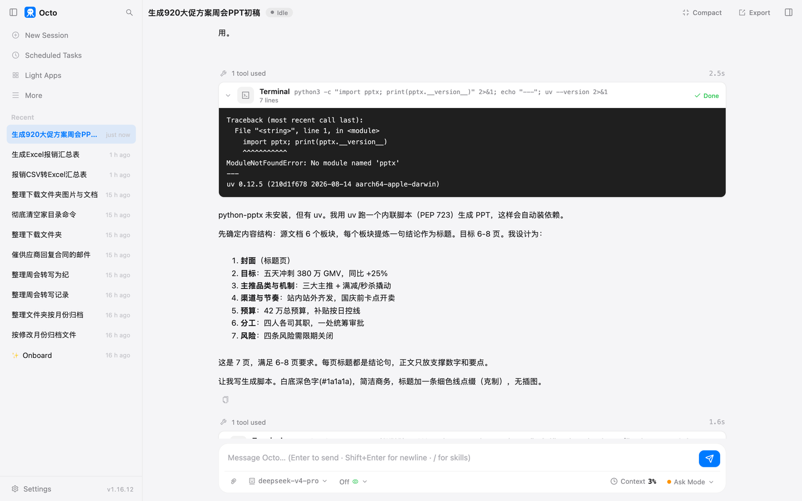
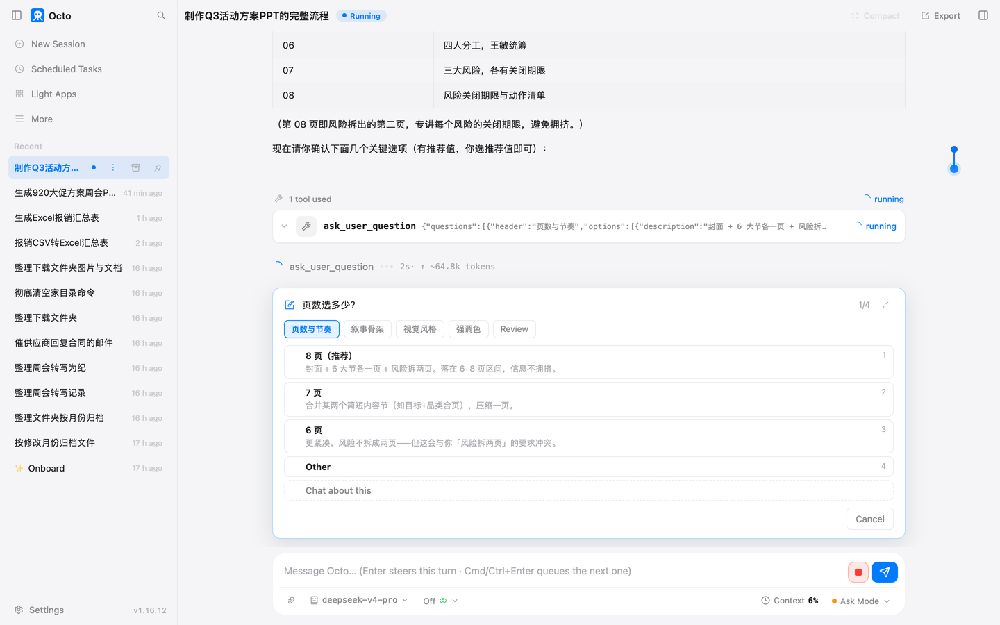
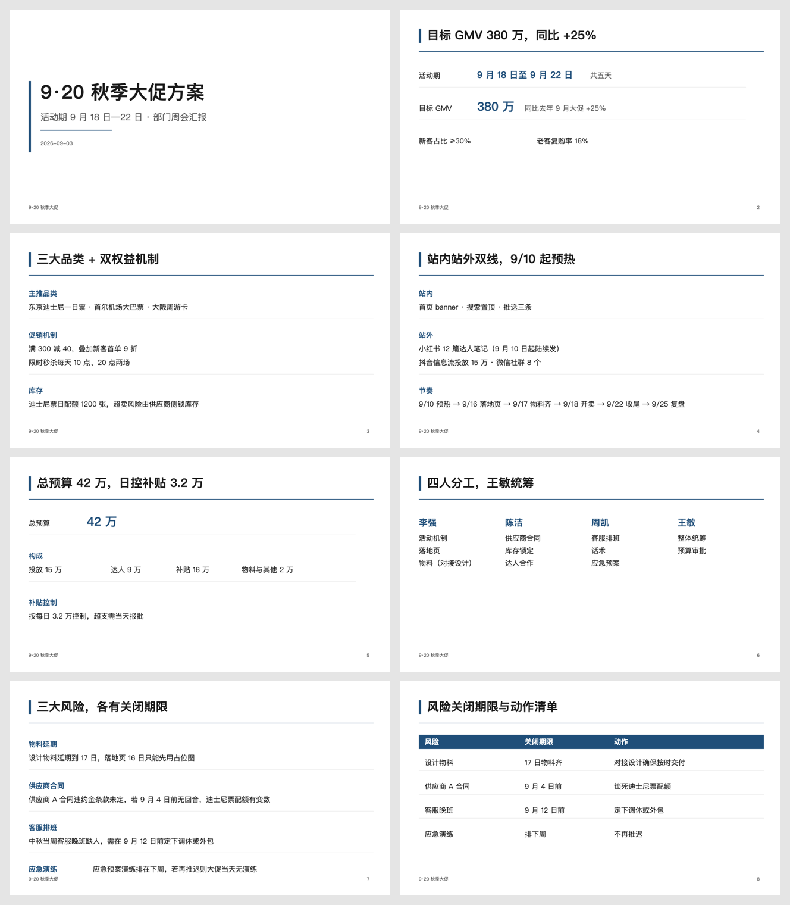

# 第 5 章 一份 PPT 初稿

周会要汇报一个活动方案，方案是一份七百字的文档，六个小节。你要把它变成八页 PPT。
这一章让它做两遍：一遍快的，一遍精细的。同一份说明书，两种走法，差在你说的一句话上。

## 准备什么

一份方案文档，Markdown 格式，六节：目标、主推品类与机制、渠道与节奏、预算、分工、风险。
里面有具体数字、日期、人名和四条风险。你手上的方案是 Word 也行，它读得懂。

## 快的一版

> 把这个方案文档做成一份 PPT 初稿。想要的结果：在同一个文件夹生成 920大促方案_周会.pptx，6 到 8 页，给部门周会汇报用；每页一个结论当标题，正文只放支撑这个结论的数字和要点；风格简洁商务，白底深色字，不要插图。别碰的：不要改源文件；不要编造方案里没有的数字。算做完：文件能用 PowerPoint 打开，页数在 6 到 8 之间，每页标题都是一句结论。做不完怎么办：图表做不出来就用文字列表代替。要问我的：只在必须选的时候问，能按推荐值走的就按推荐值走，别一步一确认。

一分四十一秒，七页。它先读了方案，加载了做 PPT 的那份说明书，然后列出七页的结论标题，直接开始生成：

| 页 | 标题 |
|---|---|
| 1 | 9·20 秋季大促活动方案 |
| 2 | 五天冲刺 380 万 GMV，同比 +25% |
| 3 | 三大主推 + 满减折扣，锁库存控超卖 |
| 4 | 站内站外齐发，国庆长假前卡点开卖 |
| 5 | 42 万总预算，补贴按日 3.2 万控线 |
| 6 | 四人各司其职，统筹与审批集中一处 |
| 7 | 四类风险需限期关闭，采购与客服是关键 |

结构是对的。每页一个结论，正文全是方案里的数字。但看第 4 页的标题："国庆长假前"。方案里没有这四个字，
活动是 9 月 18 日到 22 日，离国庆还有一周，它自己推了一步。我说的是不要编数字，它没编数字，编了一句话。

还有一处它主动交代了。那份说明书里有一套很细的流程，它没走，原话是：

> 用的是直接生成，而非完整多角色流程。考虑到这是份初稿且约束清晰无歧义，直接脚本生成更快、更可控，也避开了流程里需要逐项向您确认的阻塞步骤。

因为我说了"别一步一确认"。它把这句话当成了选走法的依据。

## 改稿

> 改三处：第 4 页标题里的"国庆长假前"方案里没有这句话，去掉，按方案原文重写标题；第 7 页太挤，拆成两页，一页讲风险、一页讲每个风险的关闭期限；所有页的标题控制在 15 个字以内。改完把新的页数和每页标题列给我。

八页。第 4 页标题变成"站内站外齐发，9/18 准时开卖"，来自方案原文。第 7 页拆成了"四项风险待限期关闭"和"三条期限须开卖前关闭"，
后一页按日期排：9 月 4 日前、9 月 12 日前、9 月 17 日。

"15 个字以内"它没有完全做到。第 2 页标题"五天冲刺 380 万 GMV，同比 +25%"，它按汉字数是 12 个，按字符数是 22 个。
它选了前一种数法，我没说清楚。你说"字"的时候，数字和标点算不算，它会自己定一个。

## 精细的一版

新开一场对话，这次说：

> 用 ppt-master 的完整流程，把这个方案做成一份 PPT。想要的结果：生成 920大促方案_精致版.pptx，6 到 8 页，周会汇报用；每页一个结论当标题；简洁商务，白底深色字，不要插图。别碰的：不要改源文件；不要编造方案里没有的数字。要问我的：流程里该确认的地方照常问我，选项给推荐值我就选推荐值。

它先读了说明书，再读说明书指向的十几份参考文件：风格目录、版式规范、字号标准。这一步就花了六万多 token，十来分钟。
然后它停下来，一张卡片四个问题：页数、叙事骨架、视觉风格、强调色，每个都带一个推荐值：

我全选推荐。之后它不再问了，一页一页写画面，写完导出，八页，每页还带了一段讲稿放在备注里。
五十分钟，十万 token。

这一版的标题全部在 15 个字以内，全部来自方案原文，没有"国庆长假前"这种推断。
第 8 页的风险表是三列：风险、关闭期限、动作。整体是一套干净的商务版式，
比快的那一版强不少。

但也有一处排版错了。第 7 页最后一条风险，标签和正文挤到了同一行：

八页里就这一处，但你不翻到那一页看不出来。

## 两版对比

| | 快的一版 | 精细的一版 |
|---|---|---|
| 时间 | 1 分 41 秒 | 50 分钟 |
| token | 3.5 万 | 10.2 万 |
| 你要做的 | 看结果 | 答四个问题，然后等 |
| 页数 | 7，改稿后 8 | 8 |
| 讲稿 | 无 | 每页一段 |
| 标题 | 有一处推断 | 全部来自原文 |
| 排版 | 简单，干净 | 讲究，一处重叠 |
| 适合 | 周会、内部对齐、改稿基础 | 对外、对上、要直接用的场合 |

两版的权限框加起来弹了三十一次，绝大多数是精细版的：每写一页画面、每跑一步导出都要一次。

## 发生了什么

**同一份说明书，走法由你一句话决定。** 那份说明书里写着一条完整流程，也留了余地。你说"别一步一确认"，
它就绕开流程直接生成；你说"照常问我"，它就走完整流程。哪种走法都对，看你要什么。

**精细流程贵在读参考和逐页手写。** 十万 token 里有一大半花在开工前读那十几份规范上，然后每一页画面都是它单独写的。
这是它能做出干净版式的原因，也是它慢的原因。这个价钱值不值，看这份 PPT 给谁看。

**它擅长结构，不擅长盯细节。** 结论式标题、拆页、把四条风险排成三列表格，这些它做得比多数人快。
但一页里两个元素叠在一起这种事，它自己看不出来。你要一页一页翻，尤其精细版，它没有在最后再看一遍自己的画面。

**"别一步一确认"和"照常问我"是两个开关。** 第 2 章讲过"要问我的"这一条控制它问多少。这一章你看到它还控制它走哪条路。
一份初稿用前者，一份要直接投屏的用后者。

**你不在，它就一直等。** 精细版停在四个问题那里等我，我没及时回答，它等了四十五分钟一动不动。
这是对的行为，但你要知道：一个需要你确认的活，你走开它就停。第 11 章讲定时任务的时候，这个问题会变成设计上的选择。

## 你要重点检查什么

- 每一页的标题和数字对着方案原文过一遍。"不要编数字"挡不住"编一句话"。
- 精细版每一页翻一遍，看有没有元素重叠、文字被截。
- 讲稿是它写的，念之前自己读一遍。
- 页数、文件名、放的位置是不是你说的。

## 翻车点

- **标题里出现原文没有的推断。** "国庆长假前"。"别碰的"要写成"不要加方案里没有的说法"，比"不要编数字"宽。
- **"15 个字"数法不一。** 它按汉字数，你可能按字符数。说清楚数字和标点算不算。
- **精细版一页排版重叠。** 八页里一页，位置在页尾。
- **我发错了会话。** 我把改稿意见发进了正在走精细流程的那一场，它没有乱改，反问我"你说的第 4 页是基于哪一份稿"。它核对了自己的上下文，比我细心。

## 风险提醒

方案文档里有预算和人名，走的是云端模型，同第 4 章的提醒。另外，精细版会在源文件旁边建一个项目文件夹，
里面是它的中间产物，几十个文件。别删，改稿要用；也别当成交付物发出去。

## 花了多少

| 活 | 时间 | token |
|---|---|---|
| 快的一版 | 1 分 41 秒 | 3.54 万 |
| 改稿一轮 | 约 4 分钟 | 未单独记录 |
| 精细的一版 | 50 分 7 秒 | 10.2 万 |

精细版按第 2 章的峰时价，缓存命中很高，一单一块钱以内。快的一版几分钱。

## 上册对照

上册练习 16 到 18 写的 skill 加载器和按需触发，这一章两次加载同一份说明书，走了两条不同的路，是那三个练习里没有的一层：
说明书写了流程，模型还是会看你的话决定怎么用它。

*最后核对：2026-09-03，octo 1.16.12。*

