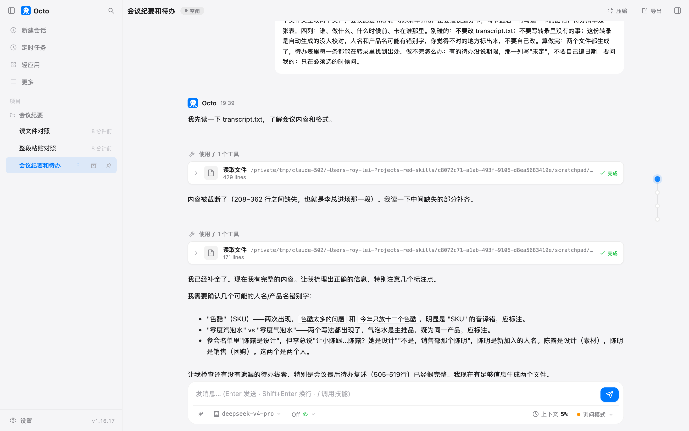

# 第 6 章 两小时会议记录变纪要和待办

会散了，纪要没人写。两小时的记录一万多字，从头看一遍二十分钟，看完还要把谁该干什么挑出来。
这一章把这个活交出去。顺带弄清一件你迟早会撞上的事：一份很长的材料丢给它，它到底看见了多少。

## 准备什么

一份会议文字稿。我这份是 9·20 大促的项目启动会，581 行、一万两千字、七个人，从下午两点说到三点五十三。
存成 txt 是 4 万 9 千字节，这个数后面有用。里面有休息时聊团建和食堂的十分钟，有转录软件听错的词，
有一个人被叫过三种称呼，还有老板中途进来推翻了前面定好的目标。你手上真实的会议记录也长这样。

它读文字，不听声音。录音先转文字：飞书妙记、腾讯会议这类会议软件自带转录，导出来就是一份文字稿。
也可以让它自己装一个转录模型来干这一步——它有终端，装得了命令行工具就跑得起转录——
但多数公司的会议软件已经把这一步做完，这一章从文字稿开始。

## 跟它怎么说

> 这个文件夹里有一份会议转录，transcript.txt，一场两小时的项目启动会，七个人。要处理的就是它。想要的结果：在同一个文件夹生成两个文件，会议纪要.md 和 待办清单.md；纪要按议题分节，每节最后一行写这一节的结论；待办清单是一张表，四列：谁、做什么、什么时候前、卡在谁那里。别碰的：不要改 transcript.txt；不要写转录里没有的事；这份转录是自动生成的没人校对，人名和产品名可能有错别字，你觉得不对的地方标出来，不要自己改。算做完：两个文件都生成了，待办表里每一条都能在转录里找到出处。做不完怎么办：有的待办没说期限，那一列写"未定"，不要自己编日期。要问我的：只在必须选的时候问。

六个要素都在里面（第 2 章那六条）。这一章多了一条第 2 章没有的交代：**转录有错别字，标出来但不要改**。
自动转录一定有听错的地方，你不说这句，它会挑一个自己觉得对的写进纪要，而你看不出哪里被改过。

## 它做了什么

| 时间 | 动作 |
|---|---|
| 2.5 秒 | 读 transcript.txt |
| 7 秒 | 又读了一遍，这次从第 200 行起、读 170 行 |
| 15 秒 | 列一下目录，确认自己在哪、文件在不在 |
| 69 秒 | 开始写纪要（前面 54 秒在读和想） |
| 92 秒 | 开始写待办表 |
| 105 秒 | 完。两个文件，权限框弹了两次，都是写文件 |

产出：会议纪要.md 119 行，按七个议题分节，每节最后一行是"▶ 结论"打头的整句；
待办清单.md 是一张表，44 条待办。

它自己标出来的三处存疑，一处都没改原文：

- "色酷"应是 SKU（"色酷太多的问题"、"今年只放十二个色酷"）
- "零度汽泡水"和"零度气泡水"两种写法混用
- "陈露是设计"和"销售部那个陈明"是两个人，不是同一个名字听错

第三条是我埋的坑，它跨了七十分钟的两段对话把这两个人分清了。

## 它一次没读完

看第一个工具卡片：**429 lines**。文件是 581 行。

它下一句话直接说了："内容被截断了（208-362 行之间缺失，也就是李总进场那一段）。我读一下中间缺失的部分补齐。"
然后从第 200 行往后又读了 170 行。

为什么会截断：单条工具结果超过 4 万字节，octo 会从中间掐掉一段再交给模型，头尾都留着，
中间插一行说明掐了多少字节。我这份转录带上行号是 5 万 3 千字节，掐掉了 13574 字节，
剩下 3 万 9 千多，正好卡在 4 万以内。它读到的就是那行说明，所以知道自己缺了哪一段。

这条上限跟模型的上下文窗口没关系，你怎么交代也改不了它。**一个文件超过 4 万字节，它一次读不完**，
这是你今天就会撞上的边界，而不是"上下文满了"那种要攒很久才发生的事。

好消息是它会自己补读。坏消息是它不一定补得完整：这一次它补的是 200 到 369 行，
掐掉的那段结束在 362 行，刚好覆盖住；如果掐掉的是两段、或者它补读的范围算错了几行，
你不去看那两个卡片上的行数，是发现不了的。

**怎么办：** 长文件先自己拆。一份三小时的会议记录按议题拆成三四个文件，
或者直接跟它说"分段读，每次两百行，读完一段再读下一段"。一个汉字占三个字节，一万字上下就顶到
4 万字节这条线了——我这份一万两千字，存成文件 4 万 9 千字节，已经过线。

## 粘贴还是给它文件

我把同一份转录用两种方式给它，问同样三个问题：几个议题、参会几人、最后定的上线日是哪天。

| | 整段粘进对话框 | 放成文件让它读 |
|---|---|---|
| 用时 | 9.6 秒 | 17.2 秒 |
| 工具调用 | 0 次 | 2 次（第二次是补读） |
| 跟模型来回 | 1 轮 | 3 轮 |
| 上下文峰值 | 37698 token（3%） | 40539 token（4%） |
| 缓存命中 | 37% | 81% |
| 议题数 | 6，对 | 6，对 |
| 参会人数 | **7，对** | **8，错**（把中途路过的老板算进了参会；转录头标写的是七人） |
| 上线日 | 9 月 11 号，对 | 9 月 11 号，对 |
| 中间被掐 | 没有 | 掐了 13574 字节 |

粘贴更快、更省一点，而且不会被那条 4 万字节的上限掐——那条上限只管工具结果，不管你自己打进去的字。
人数答错这次出现在读文件那一边，但只跑了一次，算不上哪种方式更准的证据；
两次答案不一样本身才是要记住的：**同一份材料同一个问题，它两次给的数不一定相同，
参会人数这种一眼能核的事，你自己数一遍比问第三遍便宜。**

那什么时候该用文件？

- 你要它改、要它引用、要它之后再回来看的材料，放文件。文件在磁盘上，下次新开一场对话，它还能读；
  粘贴进去的那一份跟着这场对话，换个会话就没了。
- 一次要给好几份材料的，放文件。一份粘完再粘一份，你自己会粘乱。
- 超过 4 万字节又不想被掐中间的，粘贴反而完整——代价是它永久占在对话里，
  往后每一轮都跟着一起发。

## 改两处

第一版有两个问题：待办表的说明里写着每条都标了出处，表里一条出处都没有；纪要 119 行，
发群里没人看。接着在同一场对话里说：

> 两处要改。第一处：待办清单开头的说明里写了"括号内为转录时间戳出处，方便核对"，但表里一条出处都没有，把出处加上。第二处：纪要太长，我要一份能直接发群里的，另存 纪要_精简.md，一屏能看完，只保留每节的结论行和那 6 条待确认。改完告诉我两个文件各多少行。

35 秒，权限框三次。待办表多了第五列"出处"，每条一到三个时间戳（"00:06:29 / 01:08:55 / 01:34:50"
这种，一件事在会上被提过几次就标几个）。精简版 22 行：七行结论加六条待确认，一屏看完。

我说的是四列，它加成了五列。出处放进四列里没地方，加一列比挤在"做什么"里面清楚，
这个自己拿的主意是对的。

## 上下文那一栏

输入框右下角有一栏"上下文 5%"。这一章从头到尾，它在 2% 到 5% 之间。

那 5% 是什么：这场对话累计发给模型的内容，占模型一次能接住的最大长度的比例。
我用的 deepseek-v4-pro，octo 按一百万 token 算它的窗口，所以 5% 是五万 token 左右。
写这一章的时候，光是开场的系统说明和工具清单就占掉两万两千 token——**你还没说话，
表上已经是 2%**。

上下文快满的时候 octo 会自己折叠旧对话，默认在 75% 那条线上动手，
先把旧的、超过 4KB 的工具结果换成一行占位（要用再重新读一遍），还不够才叫模型把最老的几轮总结成一段摘要，
最近的内容一律不动。你也可以自己敲 `/compact` 让它立刻折叠一次。

我在这场对话里敲了 `/compact`，得到的回复是一行提示：

> Nothing to compact yet.

四万七千 token 对一百万的窗口来说什么都不算，而且它保留的"最近"那一段本来就装得下整场对话，
没有更老的内容可折叠。这本书里的活，大多数都到不了那条线。真会碰上的是三种情况：
你用的模型窗口只有几万（换便宜模型时留意这条）；你在一场对话里连着干了几十个活没有新开；
或者你让它读了几十个大文件。前两种的办法都一样简单：**一个活一场对话，干完新开一场。**

## 关掉再回来

会话是自动存的，每一轮结束就落盘。我在这场对话里前后发了五次消息，中间断开过连接，
侧栏里点回去，历史还在，它也还记得两个文件在哪、里面写了什么——
我最后一轮说"改两处"，没有重复交代文件名，它直接改对了。

侧栏的"项目"是按文件夹分的。这一章的三场对话都在"会议纪要"这个项目下面，
工具都在那个文件夹里跑。第二天要接着改纪要，从侧栏点回同一场对话就行，不用重新说一遍背景。

## 你要重点检查什么

- **表里的出处抽查几条。** 补出处那一轮它给的时间戳我抽了七条，七条都对得上。这是它做得最扎实的一块，
  但抽查的成本很低，别省。
- **有没有把最终数字回填到前面。** 见下面的翻车点，这是这一章最贵的一个坑。
- **人名。** 一个人被叫小王、老王、王经理，表里的"谁"就可能少一个人或多一个人。
- **它说自己做了多少条，跟表里数出来的对不对。** 它说 48 条，表里 44 行。有的行写了两三件事，
  所以不算数错，但你按"48 条"去派活会对不上。
- **纪要的长度。** 我这份完整版 119 行，转录 581 行。压到五分之一还是不能发群里，
  要发的话得再要一版精简的。

## 翻车点

**精简版把过时的数字放在了第一条。** 我让它另出一版一屏能看完的，
它把七个议题的结论行拎出来，第一条写的是"总目标 380 万，暂拆为气泡水 170 万＋坚果 110 万＋凝珠 60 万＋自然销售 40 万"。
这是老板进来之前的第一版拆法。真正的最终数字（气泡水 171.6 万、礼盒零售 100 万、团购 8.4 万）
在第六条里。完整版那一节的结论后面还跟了一句"细节见议题六口径段落"，
精简的时候这句指引被删掉了，只剩下一个过时的数字站在最前面。发出去，第一眼看到的就是错的。

会议中途改掉的数字，是纪要最容易出错的地方，因为按议题分节的写法天然把"当时定的"留在前面。
你要在原话里加一句：**后面被改掉的数字，前面不要留**。

**它承诺了没做。** 第一版待办表的说明里写着"括号内为转录时间戳出处，方便核对"，
表里一条出处都没有。我指出来，它才补了一列。它写说明的时候是打算做的，
写表的时候忘了，最后也没回头对一遍自己的说明。

**"未定"没有完全按我说的写。** 我说没期限的写"未定"，它写了"明天""今天下班前""随投放方案"
这类原话。它在回复里主动交代了这一点，说按原话保留最稳妥。这次它是对的——
转录里说的确实是"明天"，但如果你要把这张表导进项目管理工具，这一列还得再处理一遍。

## 风险提醒

会议记录里有人名、预算、供应商报价、去年的退款率。这些内容会整份发给模型服务商，
同第 4 章的提醒。公司对会议内容有保密要求的，先问清楚能不能走外部模型；
这一章的准确度是云端模型给的，换成本机跑的模型要自己重新验一遍。

另一件事：它读完转录之后，那份内容就在这场对话里了。你把这场对话分享给同事看，
转录也一起过去了。

## 花了多少

| 活 | 时间 | token | 缓存命中 |
|---|---|---|---|
| 出纪要和待办 | 1 分 45 秒 | 5.2 万 | 83% |
| 改两处（补出处 + 精简版） | 35 秒 | 5740 | 99% |
| 整段粘贴（对照实验） | 9.6 秒 | 2.4 万 | 37% |
| 读文件（对照实验） | 17.2 秒 | 1.9 万 | 81% |

token 那一列是界面上报的数，输入和输出加在一起。缓存命中那一列决定你实际付多少：
命中的部分按第 2 章记的价目只要三毛钱一百万，没命中的九块。改稿那一轮命中 99%，
因为整场对话前面的内容一个字没变——**在同一场对话里接着改，比新开一场重新交代便宜得多。**

按第 2 章记的 deepseek-v4-pro 峰时价，出纪要那一轮是几毛钱的量级，四场对话加起来一块钱以内。
人自己整理这份纪要要一到两个小时。

## 上册对照

上册练习 11 到 13 写的是会话怎么存下来、上下文预算怎么算、压缩怎么让模型总结它自己。
这一章拿真实材料跑了一遍：会话那一层跟练习 11 写的一样，每轮落盘、点回去接着聊；
上下文和压缩离得还很远，先撞上的是那三个练习里都没有的一条线，单条工具结果 4 万字节。

*最后核对：2026-09-10，octo 1.16.17。*

