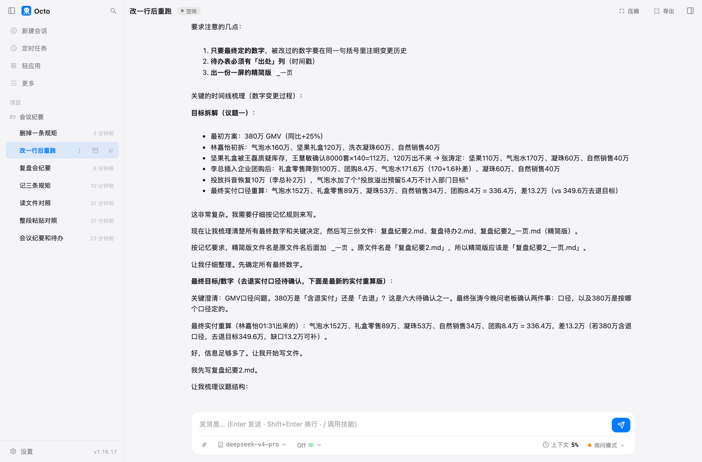
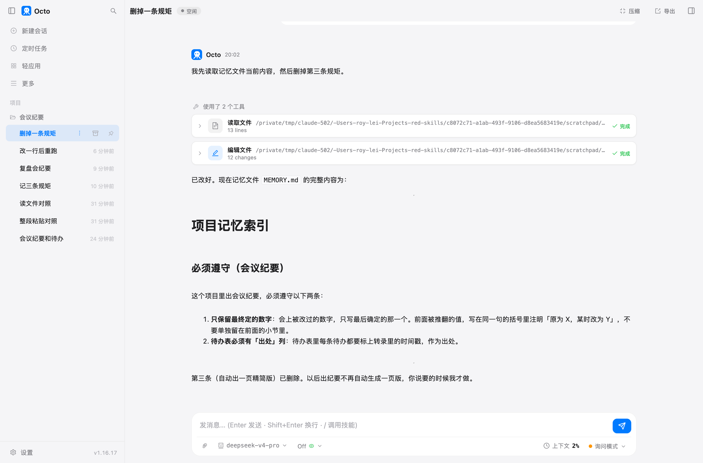

# 第 7 章 让它记住你的口味

上一章我纠正了它三次：被改过的数字别留在前面、待办表要有出处、纪要要有一版一屏能看完的。
三次都改对了，但那三句话只活在那一场对话里。第二天新开一场，它照旧犯一遍。

这一章把这三句话变成它自己会照做的规矩。

## 准备什么

- 上一章那个项目和文件夹（我这里叫"会议纪要"）。
- 一份新的会议记录。我用的是同一个项目 9 月 8 号的进度复盘会，114 行、两千七百字——
  就是上一章那场会里定的"下次会议 9 月 8 号下午三点"。这一份里到处是被改掉的数字：
  礼盒从 8000 套变成 7500 套，团购从 300 套变成 900 套，上线日从 11 号推到 12 号，
  外包客服从 4 个人变成 3 个人。正好检验第一条规矩。

## 跟它怎么说

> 记三条规矩，以后在这个项目里出会议纪要都按这三条来。一，会上被改过的数字，只写最后定的那一个，前面被推翻的值写在同一句的括号里注明"原为 X，某时改为 Y"，不要单独留在前面的小节里。二，待办表必须有"出处"一列，每条标上转录里的时间戳。三，出纪要的时候顺手出一份一屏能看完的精简版，文件名在原名后面加"_精简"。记完告诉我你记在哪个文件里、记了什么，别的先不用做。

十一秒。它先看了一眼记忆目录（这一步弹了一次权限框），发现是空的，然后建了一个文件写进去。

**写记忆文件没有弹权限框。** 前几章你已经习惯了它写文件之前要问你，记忆目录是个例外：
octo 在权限规则里给整棵记忆目录开了绿灯，它整理自己的笔记不用一次次打扰你。
这棵目录以外的地方照旧要问。

## 它记在哪

它自己报的路径：

```
~/.octo/memories/project-p5c0ae40b/MEMORY.md
```

在你自己的电脑上，不上云。文件长这样：

```markdown
# 项目记忆索引

## 必须遵守（会议纪要）

这个项目里出会议纪要，必须遵守以下三条：

1. **只保留最终定的数字**：会上被改过的数字，只写最后确定的那一个。前面被推翻的值，
   写在同一句的括号里注明「原为 X，某时改为 Y」，不要单独留在前面的小节里。

2. **待办表必须有「出处」列**：待办表里每条待办都要标上转录里的时间戳，作为出处。

3. **顺手出一份一屏能看完的精简版**：出纪要时，同时生成一份一屏能看完的精简版，
   文件名在原文件名后面加 `_精简`。
```

一共 630 字节。注意那个小标题："## 必须遵守"。这四个字是有讲究的：

- **写在"必须遵守"下面的规则，每一轮都会重新提醒它一次。** 适合绝对不能漏的事。
- 写在"触发提醒"下面的规则要配一组关键词，只在你说的话第一次碰到那个词时提醒一次。
  适合"只有干某类活的时候才要守"的规矩。
- 其余的内容是一份索引，每场新对话开头注入一次，最多前 200 行或 25KB。

这三条规矩加起来还不到 1KB，注入的开销可以忽略。文件涨到几百行就要当心了，
超过注入预算的部分不会被加载，octo 会追加一条截断警告告诉你。

在文件夹里敲一条命令能看到记忆的家在哪：

```bash
octo memory list
```

```
Memory directory: …/.octo/memories/project-p5c0ae40b
  MEMORY.md                       630B

Inherited memories: …/.octo/memories/fakehome-ba6bddc3
  (empty — nothing remembered yet)
```

两行目录，两个意思。上面那个是这个项目自己的记忆；下面那个"继承"来的是主目录级别的，
每个项目都会读到它——适合放跨项目的偏好（"给我的文件名一律带日期"），
具体到某个项目的事实放项目自己的那份。

记忆按**项目**分。侧栏"项目"区里的每一项是一个文件夹，同一个项目下的每场对话读写同一份笔记。
不归属任何项目的散落任务读的是那份继承来的共享记忆——这也是为什么，
你要它长期记住某个文件夹的规矩，就该把那个文件夹立成项目；随手开的一场对话，读的是那份共享记忆。

## 换一场对话，它自己照做了

新开一场对话，把 9 月 8 号那份复盘会的转录给它，这次只说一句话：

> 这个文件夹里有一份 9 月 8 号的复盘会转录，transcript-0908.txt。按上次的样子出纪要和待办清单，
> 文件名用 复盘纪要.md 和 复盘待办.md。

一分钟，三个文件。三条规矩它全照做了，而我一个字没重复。它自己的说法是
"按记忆里的三条规则和这个格式产出"。

第一条规矩的效果，看这几行：

> - 礼盒排产数量变化：工厂书面排产确认 9/4 已拿到，数量**由 8000 套改为 7500 套**，
>   原因是一批坚果原料检测报告晚三天（`[00:02:20]`、`[00:02:38]`）
> - 团购留货量变化：**由 300 套 + 一个未定，改为 900 套**（第一个客户 300 套确认、第二个客户 600 套）（`[00:03:01]`）
> - 物流定金：谈定 5000 元（原 8000，少 3000），合同已签、运力锁到 9/25（`[00:15:02]`）

最终值加粗，旧值在同一句里带出来。上一章那种"被推翻的数字单独占一节"的写法没有再出现。

第二条：待办表多了"出处"一列，每条一到两个时间戳。它还顺手把规矩抄进了文件开头的说明里
（"被改动的数字只保留最终值，被推翻的旧值在括号内注明"），下一个接手这张表的人也知道规矩是什么。

第三条：我根本没提精简版，它自己出了一份。

不过这一次有个变量：我说了"按上次的样子"，它就把上一章那三个文件读了一遍当模板。
所以这一轮的效果里，记忆和旧产物各占多少，说不清。下一节把这个变量去掉。

## 亲手改一行

记忆是一个普通的 markdown 文件，你可以直接改。我把第三条里的文件名后缀从 `_精简` 改成 `_一页`，
用什么编辑器都行——它就是一个文本文件。

然后把文件夹里上一章和上一节的产物全部挪进一个 `old/` 子目录，让它没有旧文件可抄。
再新开一场对话，这次连"按上次的样子"都不说：

> 这个文件夹里有 transcript-0908.txt，出一份纪要和一张待办清单，文件名用 复盘纪要2.md 和 复盘待办2.md。

结果：

```
复盘纪要2.md
复盘待办2.md
复盘纪要2_一页.md      ← 后缀跟着我改的那一行变了
```

三条规矩照旧全中，而精简版的文件名是 `_一页`，跟任何一个旧文件用过的 `_精简` 都不一样。
这一次没有旧产物可参照，规矩只能来自记忆——**你改记忆文件里的一行字，下一场对话就照新的做。**

它自己把这一步说出来了：



这一轮它读的是上一章那份 09-02 的转录，所以正好能跟上一章的产物直接比。
上一章的精简版第一条结论是这么写的：

> **议题一 目标拆解**：总目标 380 万，暂拆为气泡水 170 万＋坚果 110 万＋凝珠 60 万＋自然销售 40 万

气泡水 170 万、坚果 110 万，都是老板中途进来改掉之前的数字。这一轮同一份材料、同一个模型，
一页版长这样：

| 品类 | 目标 | 变化 |
|---|---|---|
| 零度气泡水 | **171.6 万** | 160→170（补坚果缺口）→171.6（补团购缺口 1.6） |
| 坚果礼盒（零售） | **100 万** | 120→110（库存不够）→100（团购分出 600 套） |

最终值加粗，三次变更压在一列里。同一个活，差别只在记忆里那一行字。

## 记错了怎么删

它记住的东西也会过时。上面那条"顺手出一页版"我用了两轮就嫌多余：

> 第三条规矩不要了，以后出纪要不用自动出一页版，我要的时候会说。把这条从记忆里去掉，
> 改完把记忆文件现在的内容念给我听。

十一秒，零次权限框。它把那一条删掉，把"以下三条"改成"以下两条"，编号重排，
然后把改完的文件念了一遍给我看。



要它念一遍这一步别省。记忆是它下次干活的依据，你以为删掉了、其实它只是划了个横线，
下一场对话还会照着做。

删不掉的时候还有一条路：那就是个文件，你自己打开删。`octo memory list` 打印的就是它的路径。

## 记忆和文件夹里的规则，两码事

除了记忆，还有一个地方能写规矩：文件夹里的 `.octorules`。在文件夹里敲：

```bash
octo init
```

它会先把这个文件夹看一遍，再起草一份约定，不会丢给你一个空文件。我这个文件夹里只有
一份转录和几份 markdown，它的第一句结论是：

> 这个目录**不是代码仓库**，而是「9·20 秋季大促」的会议纪要工作区——没有 go.mod / package.json /
> Makefile / CI / `.git`，也没有 build/test/lint 流程。因此 `.octorules` 写的不是命令，
> 而是这个文档工作区的**结构和业务约定**。

生成的 `.octorules` 24 行，四节：这个目录是干什么的、里面几个文件互相什么关系、
哪些业务数字是已经定死的口径（380 万总目标、各品类的拆解、谁负责什么）、
写作上必须遵守什么（六条待确认不许当已定、数字只留终值、标价和实付两个口径不许混用、
查证要回原始转录不要在几份纪要之间互相引用）。

那它跟记忆有什么分别？

|  | 记忆 | `.octorules` |
|---|---|---|
| 在哪 | `~/.octo/memories/<项目>/`，你的电脑上 | 你的文件夹里 |
| 谁写 | 它自己写、自己维护 | 你写，或者 `octo init` 起草 |
| 跟着谁走 | 跟着这台电脑上的这个项目 | 跟着文件夹走，打包发给同事也带过去 |
| 适合放什么 | 你的口味、你纠正过的地方、临时的事实 | 这个文件夹的固定约定，换谁来都成立 |

一个实用的分法：**只有你自己在意的，放记忆；换个人接手也得守的，放 `.octorules`。**
我那三条纪要规矩其实两边都该有——它在写 `.octorules` 的时候自己就把"数字只留终值"抄进去了。

## 你要重点检查什么

- **记完让它念一遍。** 它说"记好了"和文件里真写了什么是两件事，念一遍只多花几秒。
- **过一阵翻一次记忆文件。** 里面会攒下临时的事实（"礼盒 7500 套"），过了这个项目就是错的。
- **改完记忆，下一场对话验一次。** 改的是文件，生效是在下一场对话，当前这场不一定跟着变。
- **`.octorules` 里的文件清单会过时。** 它按当时的目录写死了几个文件名，
  你后面新增文件要自己去改——它自己也提醒了这一点。

## 翻车点

**记忆里的事实会腐烂。** 规矩（"数字只留终值"）能长期用，事实（"礼盒 7500 套"）
下个月就是错的。它自己分不清哪条是哪种，都当规矩记着。

**在 CLI 里当场记的规矩，当场不生效。** 命令行会话的开场说明只在启动时组装一次，
这一场对话里它写进记忆的东西，要等你下次再跑才会读到。桌面应用和 Web 控制台是每一轮重新组装的，
所以在浏览器里改完，下一轮就生效。

**`octo init` 那一轮它的终端工具被拦了。** 它在最后交代："本次会话中 `terminal` 工具的调用被策略拒绝
（strict 模式不允许提权），我只用了只读的文件工具和 glob 完成调查，未影响结果。"
命令行的 `octo init` 走的权限档比对话严，它自己绕开了。结果没受影响，
但你在别处看到"被策略拒绝"这句话，知道是权限挡的，没出错。

## 风险提醒

记忆存在本机、不上云，但它的内容每次会话都会作为开场说明的一部分发给模型服务商。
所以别往记忆里写密码、密钥、身份证号。你要它记住"我的报销单发给财务王慧敏"，
这种程度可以；"我的网银密码是"，不行。

另外，`.octorules` 跟着文件夹走。这个文件夹要发给同事、要上传到共享盘，
先看一眼 `.octorules` 里有没有不该外传的内部数字——`octo init` 那一版把 380 万的目标、
各品类的拆解、每个人的分工全写进去了。

## 花了多少

| 活 | 时间 | token | 缓存命中 |
|---|---|---|---|
| 记三条规矩 | 11 秒 | 4880 | 94% |
| 出复盘会的纪要和待办（三条自动照做） | 1 分 | 4.2 万 | 81% |
| 改一行后重跑 | 1 分 48 秒 | 4.9 万 | 86% |
| 删掉一条规矩 | 11 秒 | 1.5 万 | 80% |

记和删都是十几秒的事，几分钱。省下来的是每一次重新交代——你不用在每一场新对话开头
再把那三句话打一遍，也不用在拿到成品之后再返工一轮。

## 上册对照

上册练习 14 做过一个实验：把规矩写进规则文件，模型也不一定照做，因为它从材料里学到的习惯
比你的一句陈述更硬。这一章是同一件事的另一面：写在"必须遵守"下面的规则，
每一轮都会重新贴到它眼前一次，不只在开场说一遍。位置比措辞更能决定它记不记得住。

*最后核对：2026-09-10，octo 1.16.17。*

