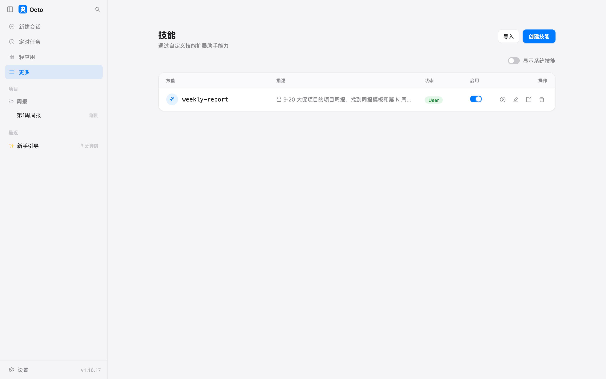

# 第 8 章 写你的第一份说明书

翻回前面几章看一眼我跟它说的话：整理文件夹那段一百多字，出 Excel 那段两百多字，
出会议纪要那段也差不多。每一次都是先把活讲一遍、再把规矩讲一遍。
上一章的记忆解决了"规矩"那一半，它记住了你的口味；但"活怎么干"那一半，
每次还得从头说。

周报是最典型的：每周五一次，材料在哪、模板是什么、五条规则、存哪个文件名，
全一样。这一章把这一套写成一份它自己会翻的说明书，以后周五只说一句话。

## 准备什么

- 一个项目文件夹，我这里叫 `weekly`，里面有：
  - `周报模板.md`：张涛定的格式，五节结构加五条规则（一页以内、群里的口头估算不算数、
    牢骚不写、同一件事说了两个数以最后一条为准、每个数字要能回到出处）。
  - `第1周_0831-0904/`：第 6 章那场启动会的纪要和待办清单，加上我这一周的工作记录、
    项目群的聊天导出。
  - `第2周_0907-0911/`：第 7 章那场复盘会的纪要和待办，加上第二周的记录和群聊。
- 群聊里我故意留了几处：周凯两次口头估预售（"大概能到 60 万"、"能到 70 万"），
  赵敏两次抱怨外包，王磊先说发票"差不多都寄了"、后来又说只到了两张。这些正是模板五条规则要拦的。

## 先手把手做一次

第一周我按前几章的老办法，把活从头讲一遍：

> 项目里挂的 weekly 文件夹里有一份 周报模板.md，是张涛定的格式。给第 1 周（8/31–9/4）出一份项目周报，素材在 weekly/第1周_0831-0904 里：会议纪要.md 和 待办清单.md 是 9/2 启动会的，工作记录.md 是我这周的流水，群聊导出.txt 是项目群的消息。按模板的五节写，模板里"规则"那一节的五条都要守：群里的口头估算不算数字，牢骚不写，同一件事说了两个数以最后一条为准，每个数字后面括号标出处，一页以内。写完存到 weekly/周报/周报_第1周_0831-0904.md，然后把全文贴给我看。

272 个字。一分钟，三次权限框，周报出来了，34 行。五条规则它都点了名：
周凯那句 60 万没写，赵敏的抱怨没写，发票按"到了两张、第三张下周"写，礼盒库存只写 7500 套、括号注"原为 8000 套"。

但有一处要你自己看出来。"下周计划"第一行：

> | 张涛 | GMV 口径与 380 万定标口径向老板确认 | 9/8 |

这一条 9 月 3 号就办完了，群里张涛早上转了老板的答复。它把待办清单（9 月 2 号的）里的这一行照抄进了下周计划，
没有拿 9 月 3 号的群消息去销掉。待办清单比群聊老一天，它没有按时间先后核对。
这一条我记下来，下面会用到。

## 说一句"把这个流程做成技能"

周报出来之后，我在同一场对话里接着说：

> 可以。把刚才出周报这个流程做成一个技能。以后每周五我只想说一句"出这周的周报"，它就按今天这套来：找模板、找那一周的素材文件夹、守模板里的五条规则、存文件、贴全文。

它先干了两步：看了一眼 `~/.octo/skills/` 下有没有已经写好的技能（空的），
再翻出一份内置技能的说明书当范例读了一遍。然后弹了一张问题卡：


两个问题，每个都给了选项和推荐：

- **技能范围**：绑定当前项目（把文件夹路径、模板路径写死进去），还是做成通用的（每次告诉它路径）？
- **周次推断**：说"这周"的时候，是按文件夹名里的日期范围自动匹配今天，还是从 8/31 起算周数，还是每次问你？

我两个都选了推荐项：绑定当前项目，按文件夹名匹配。它写了一个文件，又顺手在项目记忆里记了一段
"周报流程见 weekly-report 技能"，然后报告：

> 位置：`~/.octo/skills/weekly-report/SKILL.md`（用户级，你在任何项目都能用）
> 触发语：「出这周的周报」，以及「出周报」「写周报」「更新周报」「出第N周周报」都会命中

写技能那一轮它实际干活的时间大约一分钟，四次权限框，其中两次是读目录，一次写文件，一次核对写好的目录。

## 说明书长什么样

那个文件就是一份 markdown，59 行、4.4KB。开头几行是这样的：

```markdown
---
name: weekly-report
description: 出 9·20 大促项目的项目周报。找到周报模板和第 N 周的素材文件夹（会议纪要、待办清单、工作记录、群聊导出），按张涛定的五节模板写，严守五条规则，存到 weekly/周报/ 并贴出全文。Use when the user says "出这周的周报" / "出周报" / "写周报" / "更新周报" / "出第N周周报".
---

# 出 9·20 大促项目周报

这是 9·20 大促项目专属的周报生成流程。用户在每周五说一句「出这周的周报」，
就按下面这套完整流程走一遍：找模板 → 找素材 → 守规则写 → 存文件 → 贴全文。

## 项目与路径（写死，勿改）

- 项目根：`/…/weekly`
- 模板：`$WEEKLY/周报模板.md`（张涛 2026-08-28 定）。
- 素材文件夹：`$WEEKLY/第N周_MMDD-MMDD/`，内含四份文件：
  …

## 第 1 步：确定「这一周」和素材文件夹

1. 列出 `$WEEKLY/` 下所有目录，找出形如 `第N周_MMDD-MMDD` 的素材文件夹。
2. 取**日期范围覆盖「今天」的那个**文件夹作为本周。用 `date` 拿今天的本地日期……
```

往下是第 2 步五节结构、第 3 步五条规则、第 4 步写文件加贴全文，最后一节
"数字口径提醒"把 GMV 含退去退、礼盒 8000 变 7500 这些本项目容易错的地方也写了进去。
这些都是它从我们刚才那一场对话里摘出来的。

一份说明书就三部分：

| | 是什么 | 谁看 | 什么时候看 |
|---|---|---|---|
| `name` | 显示用的名字 | 你 | 面板里、斜杠菜单里 |
| `description` | 一句话说这份说明书管什么活、什么话会触发 | 它 | **每一场对话开头**都在眼前 |
| 正文（`---` 下面的全部） | 活怎么干，一步一步 | 它 | **只在活对上号的时候**才读 |

`description` 是开关。每场对话开始，octo 把所有技能的名字和这一句话列成一张清单贴在它的开场说明里，
正文不贴。它看到你的话跟哪一句对上了，才去把那份正文读进来。所以这一句要写得像触发词，
它自己写的那一句末尾专门列了五种说法，都是为了让"周报"两个字对上。

正文是按需读的，这意味着两点：一，正文长一点不要紧，没触发的时候不占地方；
二，正文写得再好，`description` 没对上就永远读不到。

还有一个容易糊的地方：**文件夹的名字才是这份技能真正的名字**，frontmatter 里那个 `name` 只是显示。
`~/.octo/skills/weekly-report/` 这个目录名，就是斜杠菜单里 `/weekly-report` 的来历。

## 下周五，一句话

新开一场对话，四个字：

> 出这周的周报


第一个动作，发出去不到三秒：加载技能。然后按说明书走：查今天是几号（9 月 11 号，周五），
列出 weekly 下的文件夹，落在 `第2周_0907-0911` 里；读模板，读四份素材，写，存，贴全文。
55 秒，两次权限框（一次是查日期加列目录，一次是写文件）。272 个字变成了 4 个字。

结果里五条规则照样都在：周凯 70 万那句没进（它还补了一句"张涛回'等 12 号的数'，等于没认"），
赵敏的牢骚没进，上线日只写 9/12 早上、括号注原为 9/11，客服外包只写 3 人、注原报 4 人。

它在末尾自己指出了两点，值得看：

> 素材文件名与技能文档不一致：技能里写的是「会议纪要.md / 待办清单.md」，本周实际是「复盘纪要.md / 复盘待办.md」，内容对应上了，我没受影响，但建议后续以实际为准或更新技能。

> 下周计划里「周凯补第三张发票」出自群 9/11 王磊说「第三张发票下周再催」，严格讲是王磊在催、不是周凯，我把它归到了周凯身上。这点你可以确认下归属。

第一条说明书写死了第一周的文件名，第二周文件名换了，它自己对上了，但也提醒你去改说明书。
第二条它把一项待办归错了人，还主动交代了。

## 技能面板

侧栏"更多"里有一个"技能"面板：



"显示系统技能"那个开关打开，能看到 octo 自带的 21 份说明书：出 Excel 的 office-xlsx、出 PPT 的 ppt-master、
帮你写技能的 skill-creator，前几章你已经在活里碰到过几个。它们住在另一个目录 `~/.octo/skills-default/`，
升级的时候会被刷新，不碰你自己写的。你在 `~/.octo/skills/` 下放一份同名的，就会盖过内置的那份。

每一行右边四个按钮：在新对话里用、用 agent 编辑（开一场对话让 skill-creator 帮你改）、导出成 zip、删除。
左上角"导入"能贴一个 GitHub 链接、一个 `作者/仓库` 短名、一个本机路径，或者选一个 zip。
所以把说明书发给同事的路是：你这边导出 zip，他那边导入。

对话输入框里敲一个 `/`，也会弹出这份清单：


选中它只是把 `/weekly-report ` 填进输入框，后面照常打字。走的还是同一条路：
这一行文字发给它，它去加载说明书。所以"出这周的周报"和 `/weekly-report 出这周的周报` 效果一样，
前者靠 `description` 对上，后者你直接点了名。

## 亲手改一行

前面记下的那一条，"已经办完的事又进了下周计划"，根子是它不知道上周报过什么。
那就在说明书里加一步。我打开 `~/.octo/skills/weekly-report/SKILL.md`，在第 1 步末尾加了一行：

```markdown
5. 再读一遍上一周的周报（`$WEEKLY/周报/` 里周次比本周小 1 的那份）。上周已经写进「本周完成」的事，这周不许再写进「本周完成」，最多在「进行中 / 有变化」里提一句变化。
```

存盘。把刚出的第 2 周周报挪进 `old/`，新开一场对话，还是那四个字。

**它读的是旧版。** 53 秒出来的周报没有读上周那份，事件记录里它加载到的说明书正文也没有我加的那一行。
原因：octo 启动的时候把所有说明书读进内存，之后不会自己盯着磁盘。你在文件里改的字，它要等一个"重新读盘"的时机。

这个时机之一就是打开技能面板。我点开"技能"面板看了一眼（什么都没点），关掉，再新开一场对话：

这一次它加载到的正文有了那一行，动作里多了一步读 `周报_第1周_0831-0904.md`，64 秒。
所以**改完说明书，去技能面板看一眼再开新对话**。面板每次打开都会重新读一遍磁盘，
导入、开关、删除也会。重启 octo 也行，但没必要。

改生效了，结果呢？上周"本周完成"第二条是 GMV 口径定了去退，这一周的"本周完成"第二条还是它：

> 2. GMV 口径定稿：对外 380 万（含退）、内部按 349.6 万（去退，8% 退款率）考核（群 9/8）。

说明书写了"不许再写"，它也读了上周的周报，还是写了。它的理由大概是复盘会上正式关闭了这一条，
算这周的事。这跟第 5 章那次一样：说明书定的是流程，每一步怎么判断还是它临场拿主意。
说明书能把"读上周周报"这一步钉死，钉不死"读了之后怎么想"。
这一条留给"你要重点检查什么"。

## 记忆、文件夹规则、说明书

到这一章，能让它"记住"的地方有三个了：

| | 记忆（第 7 章） | `.octorules`（第 7 章） | 说明书 |
|---|---|---|---|
| 放什么 | 你的口味、你纠正过的地方 | 这个文件夹的固定约定 | 一个活从头到尾怎么干 |
| 跟着谁走 | 这台电脑上的这个项目 | 文件夹 | 这台电脑，所有项目都能用 |
| 什么时候被读 | 每场对话开头（"必须遵守"那几条每轮都提） | 在那个文件夹里干活时 | 只在活对上号的时候 |
| 谁写 | 它自己 | 你，或 `octo init` 起草 | 它起草，你改 |
| 怎么触发 | 不用触发 | 不用触发 | 一句话，或 `/名字` |

一个分法：**规矩放记忆，约定放 `.octorules`，流程放说明书。** 三条纪要规矩是"口味"，进记忆；
"数字只留终值"是这个文件夹里谁来都得守的约定，进 `.octorules`；"周报怎么出"是一套步骤，进说明书。

说明书是全局的，任何项目里说"出周报"都会对上。它在问我"绑定项目还是通用"的时候就是在问这个：
写死路径的说明书换个项目就不能用了，要么换个项目再建一份，要么当时选"通用"、每次多说一句路径。

## 你要重点检查什么

- **第一次出来的周报，逐条对时间。** 待办清单上的每一条，到周报那天有没有已经办完，
  它不会主动拿更新的消息去销旧的清单。第一周那条"张涛向老板确认口径"就是这么漏的。
- **说明书写完，自己读一遍。** 它把第一周的文件名写死了，第二周就对不上。写死的还有文件夹路径，
  文件夹搬家说明书就失效。它自己在文件里标了"写死，勿改"，那一节就是你要盯的。
- **改完说明书，开面板刷一下，再验一次。** 改的是文件，生效要等重新读盘。验的时候看它第一个动作加载的是哪份，
  看结果里有没有你加的那一步的痕迹。
- **说明书里的规则，它是照做还是照读。** "读上周周报"它做了，"上周写过的不再写"它没守。
  每周花十秒对一下上周的"本周完成"。
- **归属。** 群里谁说的、谁负责，它会归错人，这次是把王磊在催的发票记到了周凯头上。它自己交代了，
  下次不一定。

## 翻车点

**改了文件，它读的还是旧的。** 上面演示过了。说明书在 octo 启动时读进内存，磁盘上改了不会自动同步，
要打开一次技能面板，或者导入、开关、删除任何一份技能，或者重启。新开一场对话不算。

**一份说明书，两处记录。** 它写技能的时候顺手在项目记忆里也记了一段"周报流程见 weekly-report 技能，
模板在 weekly 下，五条规则……"。它自己提醒了"若项目目录变动，技能里和项目记忆里各有一处路径要同步改"。
你要是只改了说明书，记忆里那段旧的还在每场对话开头贴给它看。

**说明书写了，它读了，还是没守。** "上周写过的事不再写进本周完成"这一条就是例子。
说明书能保证它走完每一步，不能保证每一步的判断跟你一样。这一点越早接受越好，
它决定了你该把检查放在哪：放在它的判断上，别放在它有没有读说明书上。

## 风险提醒

说明书是全文发给模型服务商的。它自己写的这份里有项目的目标数字、口径换算、人名、
文件夹的绝对路径。这些进说明书没问题，但别往里写密码、密钥、身份证号，
跟第 7 章说记忆时一样。

导出给同事之前打开看一遍。这份 `SKILL.md` 里"数字口径提醒"那一节写了 380 万、349.6 万、
礼盒 7500 套，你导出的 zip 就是这些字。

`description` 那一句每场对话都在它眼前，不管你在干什么活。所以写在那里的字，
是你每一场对话都在花钱发出去的字。它写的这一句一百来字，可以忽略；
要是你攒了三十份说明书，每份两百字，那就是每场对话开头六千字。

## 花了多少

| 活 | 时间 | token | 缓存命中 | 权限框 |
|---|---|---|---|---|
| 第 1 周，手把手（272 字原话） | 58 秒 | 3.7 万 | 78% | 3 |
| 把流程做成技能 | 约 1 分（另加我看问题卡的时间） | 8600 | 98% | 4 |
| 第 2 周，一句话 | 55 秒 | 3.0 万 | 83% | 2 |
| 改一行后重跑（读的旧版） | 53 秒 | 1.4 万 | 93% | 2 |
| 面板刷新后重跑（读的新版） | 64 秒 | 1.6 万 | 92% | 4 |

写技能那一轮的 token 比出周报少得多，因为它读的是刚才那场对话里已经有的内容。
一句话触发的那一轮跟手把手那一轮花的差不多，省的是你的 272 个字和每周想一遍怎么说的功夫。

## 上册对照

上册练习 16 到 18 写的是 skill 加载器：清单进系统提示、正文按需加载、按名字触发。
这一章你亲手写了一份进那个加载器的文件，也撞上了那三个练习没写的一层：加载器什么时候重读磁盘。

*最后核对：2026-09-11，octo 1.16.17。*

---
