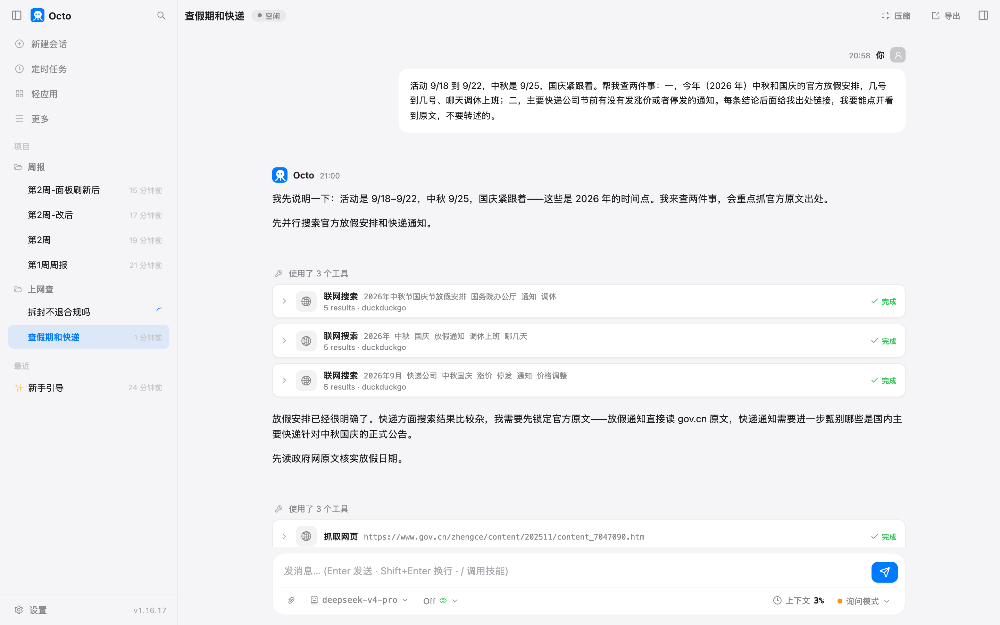
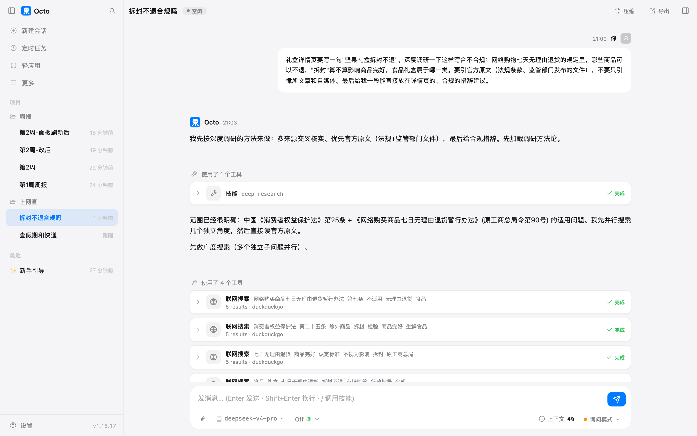

# 第 9 章 让它上网查

前八章的材料全在你的硬盘上：文件夹、表格、转录、模板。这一章的材料在网上。

上网查的活分两种。一种有明确答案，你只是不想自己翻：今年国庆几号放假、快递节前涨不涨价。
另一种没有现成答案，要它把几处说法凑起来判断：详情页写"拆封不退"合不合规。
两种都能干，两种的检查方法不一样。这一章各做一个。

## 准备什么

什么都不用装。octo 自带两个工具，界面上叫"联网搜索"和"抓取网页"：前者拿一组搜索结果（标题、链接、摘要），
后者打开一个网址、把正文转成干净的文字读进来。默认的搜索走 DuckDuckGo 的网页版，不要任何密钥；
连不上的时候自动退到必应网页版。你有 Brave、Tavily 或 Serper 的密钥，填进环境变量它会优先用，
结果质量更稳，这一章没用。

还有一份内置说明书叫 deep-research，管第二种活。你说"深度调研"、"多来源核实"这类话它就会加载。

## 快查：假期和快递

活动 9 月 18 号到 22 号，中秋 25 号，国庆紧跟着。张涛要我查两条，我原话是：

> 活动 9/18 到 9/22，中秋是 9/25，国庆紧跟着。帮我查两件事：一，今年（2026 年）中秋和国庆的官方放假安排，几号到几号、哪天调休上班；二，主要快递公司节前有没有发涨价或者停发的通知。每条结论后面给我出处链接，我要能点开看到原文，不要转述的。

最后那句"不要转述的"是关键，下面会看到为什么。



54 秒，9 次搜索，4 次打开网页，4 次权限框。**搜索不问你，打开网页才问。** 4 次权限框对应的就是那 4 个网址：
国办通知的原文、顺丰的一条公告、圆通的公告列表、顺丰的公告列表。

放假安排那一半，它搜到的第一条结果是一篇头条文章，标题写着"官方实锤"。它没引那篇，
直接打开了中国政府网上国办发明电〔2025〕7 号的原文，抄出来：

> | 中秋节 | 9 月 25 日（周五）— 9 月 27 日（周日） | 3 天 | 无调休 |
> | 国庆节 | 10 月 1 日（周四）— 10 月 7 日（周三） | 7 天 | **9 月 20 日（周日）上班**、**10 月 10 日（周六）上班** |

然后它自己加了一句我没问的：

> ⚠️ 特别提醒：你活动是 9/18–9/22，而 **9/20（周日）是国庆节的调休上班日**，正好卡在活动周期内，安排排班/值班时要留意这一点。

这一条我们开了两次会都没人提。

快递那一半更能看出"不要转述"的作用。搜索结果里一堆"快递中秋国庆涨价"的文章，它一条条打开核日期：

> - 搜到的顺丰"国庆中秋假期快件时效影响公告"落款是 **2025 年 9 月 28 日**，是去年旧文，不是 2026
> - "黑龙江圆通等 9/20 起调价"是 **2025 年 9 月**的旧闻（原文时间戳 `20250917`）
> - "UPS/FedEx/USPS 旺季附加费"是**美国**快递，与国内中秋国庆无关
> - 所谓"多轮涨价/9.9 包邮成历史"，讲的是 2026 年**上半年**加盟制快递的涨价潮，发生在 3–4 月

结论：截至 9 月 11 号，顺丰和圆通的官网公告页都没有针对今年中秋国庆的涨价或停发通知，
顺丰最新一条是 8 月 26 号的台风提醒。它还补了一句：快递公司一般临近节日才发，建议月中再查一次，
要不要设个定时任务到点复查。

这两条我自己都核过了：国办通知的日期和调休安排一字不差，顺丰那份公告的落款确实是 2025 年 9 月 28 号。

## 搜索卡片上那行小字

每张搜索卡片下面有一行 `5 results · duckduckgo`。后面那个词是搜索来源。
它拿到的搜索结果里也带着这个字段，源码里的注释说得直白：这个字段是给模型看的，
让它知道这批结果来自 Brave 或 Google 这样的正规索引，还是来自 DuckDuckGo、必应网页版的抓取，
后者的结果质量它要多打个折。

所以你看到 `duckduckgo` 或 `bing`，就知道这是免费通道的结果，前几条常常是自媒体。
它这次没被头条那篇带走，去了政府网，是它自己的判断，也是那句"不要转述的"在起作用。

## 每打开一个网页问一次

4 次权限框里，两次是同一个网站的两个页面。权限框上有"总是允许"，但它记住的是**这一个网址**：
它对权限的记法是"工具名加完整输入"，打开另一个页面就是另一个输入，照样问。

信得过的网站可以列一张白名单。`~/.octo/permissions.yml`，我写了这几行：

```yaml
web_fetch:
  - deny:  { hostname: ["10.*", "192.168.*", "127.*", "localhost", "*.local"] }
  - allow: { hostname: ["www.gov.cn", "*.gov.cn", "www.sf-express.com", "www.yto.net.cn"] }
```

第一行 `deny` 抄自内置默认规则：禁止它去抓内网地址。**你一旦在这个文件里写了 `web_fetch`，
内置的那份规则就整体被你的替换掉**，所以默认里想留的要自己抄过来。这一行就是要留的。

不用重启。同一场对话里接着问：

> 把国办那份通知里中秋和国庆两段的原话一字不改抄给我，再看一眼顺丰公告列表页现在最新一条是哪天发的、标题是什么。

10 秒，重新抓了顺丰公告页，**0 次权限框**。这份文件每次调用工具都会重新读，改完立刻生效，
收紧也是一样。

## 深查：拆封不退合规吗

第 6 章那场会上定的待办里有一条：详情页加"拆封不退"。这句话能不能这么写，没人拿得准。
新开一场对话：

> 礼盒详情页要写一句"坚果礼盒拆封不退"。深度调研一下这样写合不合规：网络购物七天无理由退货的规定里，哪些商品可以不退，"拆封"算不算影响商品完好，食品礼盒属于哪一类。要引官方原文（法规条款、监管部门发布的文件），不要只引律所文章和自媒体。最后给我一段能直接放在详情页的、合规的措辞建议。

"深度调研"四个字让它加载了 deep-research 那份说明书。那份说明书的路数是：先拆成几个独立的子问题并行搜，
再去读原始出处，再对每条结论反过来找茬，最后写一份每条都带出处的报告。



57 秒，5 次搜索，3 次打开网页（中国政府网的法规原文、市场监管总局官网、一篇转载最高法意见的新闻），3 次权限框。
报告分三段：法律规则、为什么那句话不合规、合规的措辞。核心几条它抄的原文：

> **第八条** 消费者**基于查验需要而打开商品包装**，或者为确认商品的品质、功能而进行合理的调试**不影响商品的完好**。
>
> **第九条** ……（一）**食品（含保健食品）**、化妆品……：**必要的一次性密封包装被损坏**；……
>
> 最高人民法院法发〔2022〕35 号第 7 条：消费者因检查商品的必要对商品进行**拆封查验且不影响商品完好**，电子商务经营者**不得以商品已拆封为由主张不适用七日无理由退货制度**。

它的结论：坚果礼盒不在法定不退的四类商品里；"拆封"本身够不上拒退理由；食品能拒退的口子是"一次性密封包装被损坏"，
而且要走第七条，还得"经消费者在购买时确认"，详情页贴一句话不算确认程序。所以"拆封不退"四个字照原样写，不合规。

它给的措辞：

> **退换货说明**：本商品为食品礼盒。依据《网络购买商品七日无理由退货暂行办法》，食品的"必要的一次性密封包装"如已被拆开或损坏，将视为商品不完好，无法支持七日无理由退货。收到货后请先核对商品完好再打开内层密封包装；未拆封、未损坏密封包装的，可依法享受七日无理由退货。

后面还跟了三条配套：下单流程里要有单独的确认勾选、措辞要对应礼盒的实际包装结构（外盒还是内袋）、
质量问题的退货跟这条无关，别写成"一律不退"。

我把它引的条款逐条核了一遍：第八条、第九条第（一）项的原文，第二十条里确实有"确认程序"，最高法那句一字不差。
这份报告拿去给法务看是够的；拿去直接改详情页，还差一步，下面说。

## 它标的来源，和它读的页面

报告末尾列了三个来源，最后一个写的是：

> 最高人民法院《关于为促进消费提供司法服务和保障的意见》（法发〔2022〕35 号）第 7 条——最高法公报全文

翻它的动作记录，这一条它实际打开的是澎湃新闻的一篇转载。引文本身没错，我去最高法官网核过，一字不差。
但它标的来源和它读的页面对不上。这次转载是忠实的，下次不一定。

所以带出处的报告，检查的方法是：**别看它列的来源名，看它打开过哪几个网址。** 卡片上"抓取网页"后面跟的那串就是。
它这一场打开了三个页面，两个是官网，一个是新闻转载，报告里三条来源都写成了官方。

## 你要重点检查什么

- **每一个链接点开。** 你要它给原文链接，就是为了这一步。头条文章说"官方实锤"和政府网原文是两回事。
- **每一个日期看年份。** 搜索引擎不管你要的是哪一年。这次它自己排掉了三条 2025 年的旧闻，
  但那是它这次做了，你下次还是要看。
- **"抓取网页"卡片上的网址，跟报告里写的来源对一遍。** 写"官网原文"、实际读的是转载，这次就发生了一回。
- **搜索来源那行小字。** `duckduckgo`、`bing` 是免费通道，前几条常是自媒体，它引的时候要多留一分心。
- **法律、医疗、财务这类结论，报告是给专业的人看的底稿，别当最终答案。** 这份"拆封不退"的报告条款都对，
  措辞建议也说得通，但最后拍板的应该是法务，它自己在末尾也这么说了。

## 翻车点

**它说的来源和它读的页面对不上。** 上面那一条。引文对，出处标签错。这种错法最难发现，因为内容本身没问题。

**权限框"总是允许"只记一个网址。** 你以为点了一次就不再问这个网站，其实换个页面照样问。要一个网站不问，写白名单。

**白名单写了 `web_fetch` 就替换掉了内置规则。** 内置的 deny 内网那一条如果没抄，它就能去抓你路由器的管理页、
公司内网的系统。这一条是从文档里读到的，我在文件里留了那一行，没有试它漏掉会怎样。

**说明书写的和它做的不完全一样。** deep-research 说明书里写着子问题要派给几个分身并行搜、
高风险结论要派一个分身专门去推翻。它这次全是自己一个人跑的，没派分身。结果没受影响，
但说明书写了的步骤，它不一定每一步都做。第 15 章讲分身的时候回头看这一条。

## 风险提醒

搜索词是发给 DuckDuckGo 或必应的，打开的网页内容是发给模型服务商的。所以别让它去搜带内部信息的词
（"某某公司 Q3 目标 380 万 完成率"），也别让它去抓需要你登录才能看的内页，抓下来的整页内容都会出去。
要登录的网页下一章单说。

内网地址那条 deny 规则别删。它默认不能抓 `10.*`、`192.168.*`、`localhost` 这些地址，
你写自己的 `web_fetch` 规则时把这一行抄上，是为了它不会因为一个搜索结果里的链接就去访问你公司内网。

## 花了多少

| 活 | 时间 | 搜索 / 打开网页 | token | 缓存命中 | 权限框 |
|---|---|---|---|---|---|
| 查假期和快递 | 54 秒 | 9 / 4 | 3.0 万 | 84% | 4 |
| 白名单后追问（抄原文、看最新公告） | 9 秒 | 0 / 1 | 1700 | 98% | 0 |
| 拆封不退合规吗（深度调研） | 57 秒 | 5 / 3 | 2.7 万 | 83% | 3 |

深度调研没有比快查贵，因为它没派分身。要是按说明书写的那样派四个分身并行，token 会翻几倍，
那才是"深"的代价。这次它判断问题范围已经很清楚，省了这一步。

## 上册对照

上册练习 29 加了 web_search 和 web_fetch 两个工具，讲的是工具怎么定义、结果怎么回给模型。
这一章的搜索来源那行小字，就是那一章的工具在返回结果里多塞的一个字段，专门给模型看的。

*最后核对：2026-09-11，octo 1.16.17。*

---
