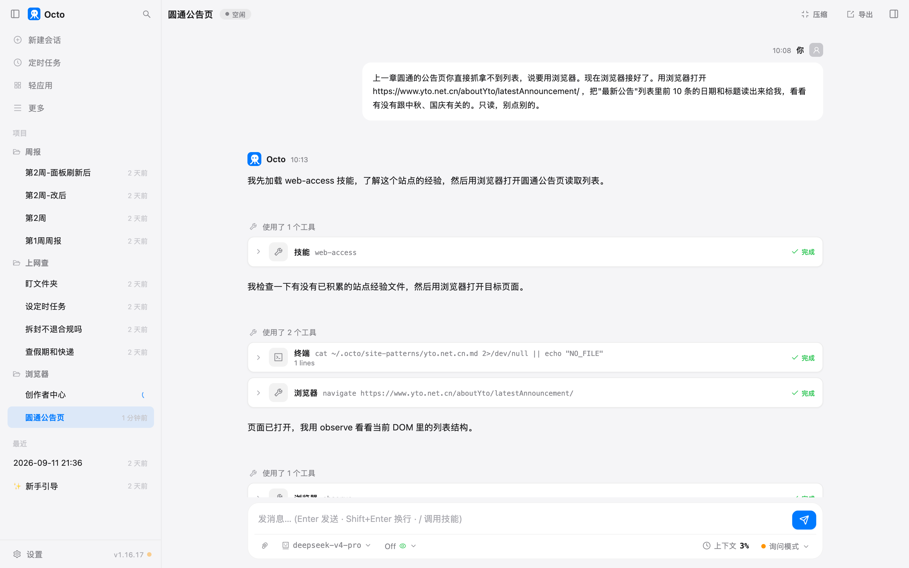
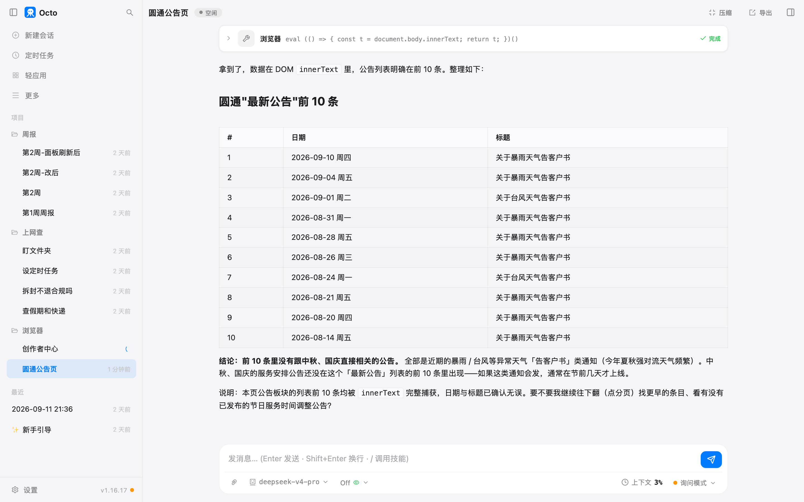
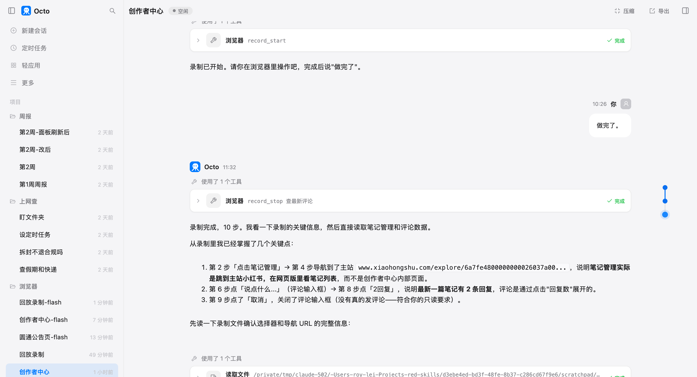
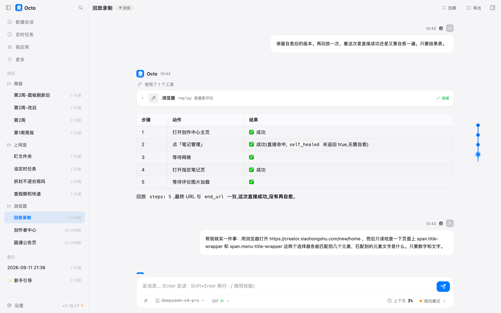

# 第 10 章 接上你的浏览器

> 这一章的功能 octo 标着 Beta。写的时候（1.16.17）能用，行为随版本变的可能性比前几章大。

第 9 章抓网页，抓的是任何人都能看的页面。第 11 章那个定时任务撞上了另一种：圆通的公告页打开是空的，
列表要等页面里的脚本跑完才出来，直接抓拿到的是骨架。还有第三种，登录了才能看的：你的小红书后台、公司的系统。

这两种都要一个真的浏览器。octo 不自己藏一个浏览器，它接上你正在用的那个 Chrome，
用你已经登录的身份，在你眼前新开一个标签页操作。

## 准备什么

- Chrome。我这台是 152。Chrome 144 起有一个开关，让 octo 能接上带着你登录态的那个 Chrome。
- 在 Chrome 地址栏打开 `chrome://inspect/#remote-debugging`，勾上"允许对此浏览器实例进行远程调试"那个选项，
  提示重启就重启，登录态不会丢。
- 命令行里跑一次 `octo browser setup`，它会探一下这条路通不通，通了就把端口记进配置。
  找不到可接的 Chrome 时它不会偷偷起一个没登录的临时浏览器，只会告诉你去开那个开关。

接上以后，octo 每次都**新开一个标签页**干活，不碰你开着的那些。授权提示只弹一次。

## 第一个活：上一章抓不到的那个列表

> 上一章圆通的公告页你直接抓拿不到列表，说要用浏览器。现在浏览器接好了。用浏览器打开 https://www.yto.net.cn/aboutYto/latestAnnouncement/ ，把"最新公告"列表里前 10 条的日期和标题读出来给我，看看有没有跟中秋、国庆有关的。只读，别点别的。



浏览器工具有好几双"眼睛"，这一轮它换着用了一遍：

| 动作 | 看到什么 | 这次的结果 |
|---|---|---|
| observe | 页面上能点、能填的元素 | 只有导航栏，没有公告列表 |
| ax | 无障碍树，屏幕阅读器看到的结构 | 有"最新公告"标题，列表条目不在里面 |
| screenshot | 截图 | 拍下来了，也发给模型了，但它说"当前模型无视觉能力"。原因在接口那一头，见翻车点 |
| eval | 在页面里跑一小段脚本，把文字读出来 | 拿到了 |

前三双眼睛都没看到列表。它第一次要用 eval 的时候我拒了（下面风险提醒会说为什么），它又滚动、又 observe，
最后停下来问我：

> 公告列表条目没有被 observe/ax 列出来，截图我也读不到（当前模型无视觉能力）。你刚才拒绝了我用 eval 读 DOM。要我用什么方式读取这个只读列表？

我选了"允许 eval 只读取文本"。它跑了一句读整页文字的脚本，前 10 条出来了：



我另外用自己的浏览器打开同一页核了一遍，十条的日期和标题一字不差。

这一轮 **23 次权限框**。浏览器的每一个动作，打开页面、看一眼、滚一下、截个图，在询问模式下都要问你一次。
第 9 章抓网页问的是"允不允许打开这个网址"，这一章问的是"允不允许点这一下"。粒度细到这个程度是故意的，
因为下一个活是在你的账号上。

## 第二个活：读自己账号的后台

小红书创作者中心，我的账号已经登录。原话：

> 用浏览器打开小红书创作者中心 https://creator.xiaohongshu.com/ ，这个 Chrome 里已经登录了。进到笔记管理，把最近 5 篇笔记的标题、发布时间、浏览、点赞、评论数读出来列成一张表。然后点开最新一篇的评论区，把能看到的评论读出来，按"提问 / 夸 / 吐槽 / 广告或无关"分四类，每条评论一行，带用户名。全程只读：不点赞、不回复、不关注、不发任何东西、不改任何设置。

页面打开了，登录态在，它看到了左侧菜单里的"笔记管理"。然后它在这一个菜单项上耗了四分钟：
点了，没跳转；用脚本找这个元素的层级，找到了，再点，还是没跳；悬停、找子菜单、找弹层，都没有。
中间它想用脚本直接触发点击，被我拒了（那段脚本里有 `.click()`）；它问我"用原生点击还是直接访问网址还是你手动点"，
我选原生点击，还是没进去。第二次问的时候，我选了"你手动点到笔记管理页"。

这一段 43 次权限框，四分钟。**它不认识这个页面。** 每个网站的菜单长得都不一样，它没有见过这一个，
只能一样一样试。读者自己的公司系统只会更陌生。

## 录一遍给它看

它试不出来的路，你点一遍它就会了。这是这一章的核心功能。

> 先停一下，别再找了。我来亲手录一遍操作给你：开始录制，录制名叫 查最新评论。我会在你打开的那个标签页里点：进笔记管理，找到最新一篇笔记，点开它的评论。我做完会说"做完了"，你再停止录制。

它调了一下 `record_start`，然后把浏览器交给我。我在它开的那个标签页里点了三下：笔记管理、最新一篇的封面、评论。
说"做完了"，它调 `record_stop`：



**录的是我的操作，不是它的。** 这跟第 8 章那份说明书是两码事：说明书写的是话，录制存的是点击。

录完它先读了一遍录制文件，从里面拿到了两条它之前四分钟没试出来的信息：笔记管理页的真实网址，
以及最新那篇笔记的网址。然后回到标签页，一看页面已经停在笔记管理，直接开始读。两分钟，最近 5 篇的表出来了：

| 标题 | 发布时间 | 浏览 | 点赞 | 评论 |
|---|---|---|---|---|
| Qwen3.8-27B开源，家用显卡可跑 | 08-15 12:01 | 9133 | 124 | 70 |
| 最注重隐私和数据安全的 AI agent | 08-14 21:03 | 228 | 0 | 3 |
| 开源AI Agent：40MB本地编程助手 | 08-14 20:24 | 313 | 2 | 4 |
| 原厂harness一定更好吗 | 08-13 12:09 | 3832 | 15 | 43 |
| 你并不需要一个 agent | 08-07 20:23 | 344 | 1 | 18 |

它自己加了一条注：列表页那一栏写 70，点进详情页评论区顶上写"共 124 条评论"，两个数口径不一样，
一个只数一级评论，一个连回复都算。这种差别你自己看后台大概也没留意过。

评论区它读到了 21 条（10 条一级评论加 11 条展开着的回复，124 条里其余的折叠着），分成四类。
提问那一类是"用的什么卡"、"占多少显存"、"5060Ti 16G 能跑吗"；夸的那一类是"试了 q3 量化非常棒"、
"1M 上下文占显存 76G，智力太顶"；吐槽那一类是"比想象中的慢"、"一天 900 万 token 写代码不够用"；
广告那一类是空的。它把作者本人的回复也标出来了，没混进去。分类合理，我逐条对过。

这一轮 22 次权限框，两分钟，4.8 万 token。四分钟没进去的门，录一遍三下点击就过去了。

## 录制文件长什么样

录制存在 `~/.octo/browser-recordings/查最新评论/` 下，两个文件。`events.json` 是原始记录，我每一次点击的位置、
元素上的文字、旁边的文字、当时的网址。`recording.yaml` 是整理过的执行计划，能看、能改：

```yaml
name: 查最新评论
description: 打开小红书笔记查看最新评论
steps:
    - action: navigate
      url: https://creator.xiaohongshu.com/new/home
    - action: click
      selector: div.list > div.d-menu__vertical:nth-of-type(2) > … > span.menu-title-wrapper
      label: 笔记管理
      anchors:
        tag: span
        neighbor_text: 首页
    - action: wait
      network: true
    - action: navigate
      url: https://www.xiaohongshu.com/explore/6a7fe48…
    - action: wait
      selector: div.swiper-backface-hidden … img
    - action: click
      label: 说点什么...
    - action: wait
    - action: click
      label: 2回复
    - action: click
      label: 取消
```

十步。每一步除了"点哪个元素"的技术写法，还存了 `label`（元素上的字）和 `neighbor_text`（旁边的字），
这两样是给以后页面改版时认路用的。

后四步要说一下：我点开评论的时候手滑点到了评论输入框，又点了一条评论的"2回复"，然后点"取消"关掉。
**录制把手滑也录进去了。** 它录的是你做的每一步，不判断哪一步是你想要的。

## 回放：三次

**第一次，原样回放。** 前五步全过，第六步"点击评论框"失败：

> step 6 (click): no element matches the recorded fingerprint (label="说点什么...", role="", tag="div") — the page changed or the target is ambiguous (self-heal gave up: heal: model could not identify a replacement selector)

错误信息后面跟了一段诊断指引：录制文件在哪、原始事件在哪、怎么区分"录制时漏了"、"整理时错了"、"页面变了"。
这段是给你看的，也是给它看的。

它看完页面，给我的诊断是：小红书主站当前**未登录**，评论框是登录后才有的元素，所以找不到。
听起来很合理。我看了一眼那个标签页右上角：是我的头像，登录着。**诊断是错的。**
真正的原因我没查出来，可能是那个输入框要滚到才渲染，可能是点击时机。但它给的那个原因说得斩钉截铁，
不看页面你就信了。

**第二次，我先改文件。** 手滑的那四步本来就不该在，我打开 `recording.yaml` 把第六步往后全删了，只留五步。
再回放，五步全过，64 秒，页面停在那篇笔记上。**录制是一个文本文件，录错了就删那几行。**

**第三次，模拟页面改版。** 我把第二步"笔记管理"那一下的选择器全改成不存在的 class，连备选的都改了，
只留下 `label: 笔记管理` 和 `neighbor_text: 首页`。回放：五步全过，返回里多了一项 `self_healed: true`，
录制文件被改写了。



到这里是文档说的那样。我多走了一步：让它去页面上数一数，写回文件的那个新选择器能匹配到几个元素。
**零个。** 它自愈时"修好"并存下来的选择器，在页面上根本不存在；原来那个真实的 class 能匹配到 6 个菜单项。
第四次回放照样成功，因为回放找元素时靠的是 `label: 笔记管理` 这个字，选择器对不对已经不重要了。

所以自愈的真相是：**救回来的是这一次回放，写回去的那个修正不一定对。** 靠得住的是你录制时元素上的那几个字。
页面改版把按钮上的字也改了，这条路就断了。

## 你要重点检查什么

- **录完先看 yaml。** 手滑的步骤、多点的一下，都在里面，删掉再用。文件不长，一眼能看完。
- **回放失败时它说的原因，去页面上看一眼再信。** "未登录"这次就是编的。
- **`label` 那一栏的字。** 回放能扛住改版靠的是它，那串选择器倒在其次。页面上按钮的字要是常变，录制就不稳。
- **它读回来的数字，找一个去后台对一下口径。** 70 和 124 那种差别，它这次自己发现了，下次不一定。
- **动作日志里有没有你没要的点击。** 这一轮它在找菜单的时候点过一次"收起侧边栏"。没造成什么，但它点了。

## 翻车点

**它不认识你的页面。** 在创作者中心找"笔记管理"耗了四分钟、43 次权限框，最后是我点的。
陌生页面的第一次，你要做好自己上手的准备，然后录下来。

**录制把手滑录进去，回放就在手滑那一步死。** 第一次回放失败的第六步，就是我误点的评论框。

**自愈写回的修正可能是错的。** 上面验过了。它不影响下一次回放（有 label 兜着），但你要是拿这个文件去别处用，
或者想读懂它，那一行是假的。

**截图发出去了，模型说看不到。** octo 这边确实把图发了（配置里这个模型标了能看图）。我后来绕开 octo，直接用同一把密钥、
同一个模型、OpenAI 兼容的图片格式发了一张 25KB 的小图过去，回答是"看不到图"，而且计费的输入只有 106 个 token，
说明 DeepSeek 的聊天接口把图丢掉了。DeepSeek 的官方接口文档里，写明能收图的模型是 deepseek-flash，没有提 v4-pro。
所以它说"无视觉能力"说的是实话，只是原因在接口而不在它。
这两轮它拍了三次图，三次都白拍，然后自己换别的办法。换一个接口真能收图的模型，浏览器这一章会顺很多。

## 风险提醒

这一章的操作对象是你**登录着的账号**。几条：

**eval 是最危险的一个动作。** 它在页面里跑一段脚本，脚本里能干的事没有上限，点赞、发评论、改设置都可以一行写完。
权限框只告诉你"eval"，不会告诉你脚本里有什么。这一章我在自己这边加了一道检查：脚本里出现点击、提交、改值这类操作就拒，
它有一次真的写了 `.click()` 被拦下来了。你没有这道检查，就只能在权限框上多看一眼脚本内容，看不懂就拒。
拒了它会换别的办法，这一章两次都是这样。

**"只读"要写进原话。** 我那句"不点赞、不回复、不关注、不发任何东西、不改任何设置"起了作用，
它每次汇报都对着这句话说"全程只读"。

**录制里的网址带着你的会话参数。** 那条笔记的网址后面有一长串 token，是当时那一次访问的凭证，
录制原样存了。这个文件别发给别人。

**它在你眼前的 Chrome 里开标签页。** 做完记得关，也记得去 `chrome://inspect` 把那个开关关掉。
开着的时候，这台电脑上任何能连到本机端口的程序都能操作你这个登录着的浏览器。

## 花了多少

| 活 | 时间 | token | 缓存命中 | 权限框 |
|---|---|---|---|---|
| 圆通公告页（含一次问我） | 约 1 分 | 3.0 万 | 91% | 23 |
| 创作者中心找"笔记管理"（没进去） | 4 分（含我答题） | 3.2 万 | 98% | 43 |
| 开始录制 | 5 秒 | 1.7 万 | 80% | 1 |
| 停止录制 + 读 5 篇数据 + 读评论分类 | 2 分 4 秒 | 4.8 万 | 97% | 22 |
| 回放 1（第 6 步失败，含诊断） | 约 1 分半 | 9300 | 96% | 5 |
| 回放 2（删掉手滑后） | 64 秒 | 4800 | 96% | 2 |
| 回放 3（改坏选择器，自愈） | 1 分 43 秒 | 2300 | 99% | 1 |
| 回放 4（验证） | 54 秒 | 520 | 99% | 1 |

回放本身几乎不花 token，那是浏览器在按步骤点，模型没参与。花钱的是它自己摸索页面的那几段，
和读回来大段文字再整理的那一段。四分钟找不到菜单花的 3.2 万，比读完全部数据还贵。

## 上册对照

上册练习 30 叫"浏览器：agent 的另一双手"，写的是怎么把 CDP 接进工具表。这一章你看到了那双手真上手时的样子：
一双手加一副看不清的眼睛，在陌生页面上要摸四分钟；你握着它点一遍，它下次就直接走。

*最后核对：2026-09-14，octo 1.16.17，Chrome 152。*

---
