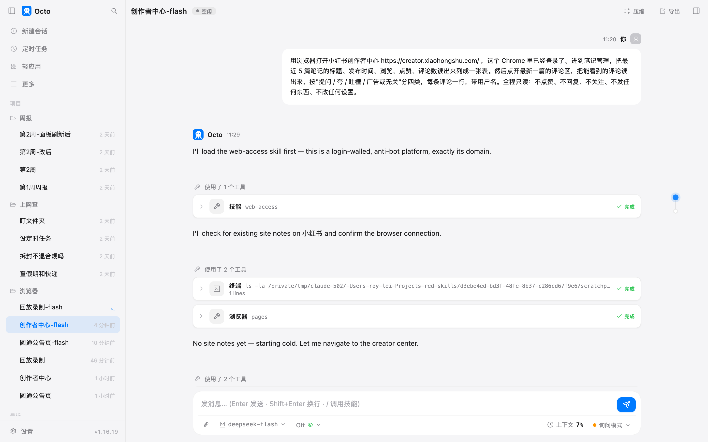
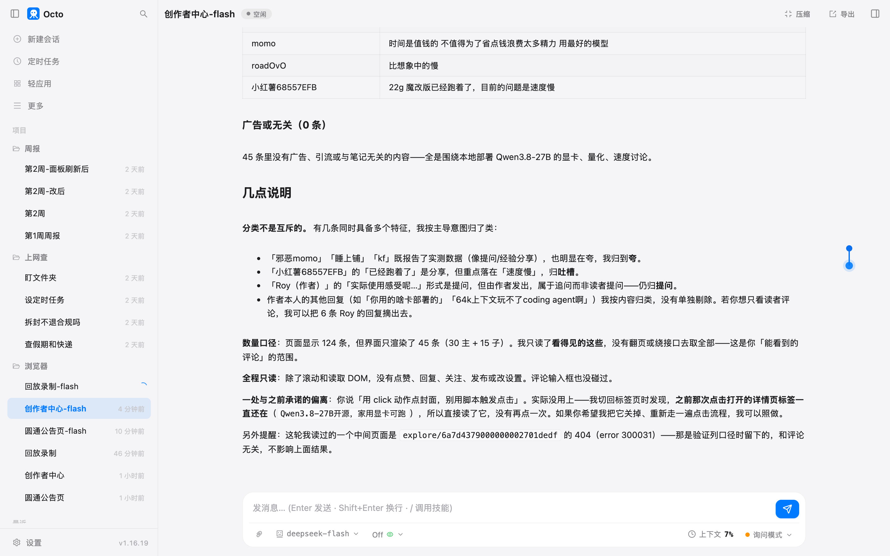

# 第 10 章 接上你的浏览器

> 这一章的功能 octo 标着 Beta。写的时候（1.16.19）能用，行为随版本变的可能性比前几章大。

第 9 章抓网页，抓的是任何人都能看的页面。第 11 章那个定时任务撞上了另一种：圆通的公告页打开是空的，
列表要等页面里的脚本跑完才出来，直接抓拿到的是骨架。还有第三种，登录了才能看的：你的小红书后台、公司的系统。

这两种都要一个真的浏览器。octo 不自己藏一个浏览器，它接上你正在用的那个 Chrome，
用你已经登录的身份，在你眼前新开一个标签页操作。

## 准备什么

- Chrome。我这台是 152。Chrome 144 起有一个开关，让 octo 能接上带着你登录态的那个 Chrome。
- 在 Chrome 地址栏打开 `chrome://inspect/#remote-debugging`，勾上"允许对此浏览器实例进行远程调试"那个选项，
  提示重启就重启，登录态不会丢。
- 命令行里跑一次 `octo browser setup`，它会探一下这条路通不通，通了就把端口记进配置。
  找不到可接的 Chrome 时它不会偷偷起一个没登录的临时浏览器，只会告诉你去开那个开关。

接上以后，octo 每次都**新开一个标签页**干活，不碰你开着的那些。授权提示只弹一次。

## 第一个活：上一章抓不到的那个列表

> 上一章圆通的公告页你直接抓拿不到列表，说要用浏览器。现在浏览器接好了。用浏览器打开 https://www.yto.net.cn/aboutYto/latestAnnouncement/ ，把"最新公告"列表里前 10 条的日期和标题读出来给我，看看有没有跟中秋、国庆有关的。只读，别点别的。

三个动作，十秒：打开页面；`observe` 看一眼页面上能点的元素，发现只有导航栏、没有列表，
它自己判断"列表是页面脚本渲染的"；然后用 `eval` 在页面里跑一句读整页文字的脚本，列表就在文字里。


它还多说了两句：栏目简介写的是"异常天气告客户书以及服务时间变更调整"，所以中秋国庆的安排如果还没发就不会出现；
日期栏带"周几"，跟日历对得上，说明没读串行。我另外用自己的浏览器打开同一页核了一遍，十条一字不差。

浏览器工具有好几双"眼睛"，这一轮用了两双。全部列一下：

| 动作 | 看到什么 | 什么时候用 |
|---|---|---|
| observe | 页面上能点、能填的元素，带文字 | 先看一眼陌生页面，最省 |
| ax | 无障碍树，屏幕阅读器看到的结构 | 要看文档结构、按钮在其次 |
| eval | 在页面里跑一小段脚本，把文字读出来 | 前两个看不到内容的时候 |
| screenshot | 截图，交给能看图的模型 | 内容是视觉的（图表、版式） |

这一轮 **3 次权限框**：打开页面一次，observe 一次，eval 一次。浏览器的每一个动作在询问模式下都要问你。
第 9 章抓网页问的是"允不允许打开这个网址"，这一章问的是"允不允许点这一下"。粒度细到这个程度是故意的，
因为下一个活是在你的账号上。

## 第二个活：读自己账号的后台

小红书创作者中心，我的账号已经登录。原话：

> 用浏览器打开小红书创作者中心 https://creator.xiaohongshu.com/ ，这个 Chrome 里已经登录了。进到笔记管理，把最近 5 篇笔记的标题、发布时间、浏览、点赞、评论数读出来列成一张表。然后点开最新一篇的评论区，把能看到的评论读出来，按"提问 / 夸 / 吐槽 / 广告或无关"分四类，每条评论一行，带用户名。全程只读：不点赞、不回复、不关注、不发任何东西、不改任何设置。



它先加载了 web-access 那份说明书（管"难搞的网站"的方法论），查了一下有没有攒下的小红书站点经验，没有，
然后开始。二十几秒里它做了这几步：打开创作者中心首页；看一眼元素；**想读一下 cookie 来确认登录身份，
被我拒了**（下面风险提醒说为什么）；转到主站看了一眼头像链接；然后直接导航到了笔记管理页的网址。
这个网址我没给，它自己走到的。

到了列表页，它读出五篇笔记，然后**停下来问我**：

> 这个 Chrome 里登录的创作者中心账号是「Roy」，笔记全是 AI/agent 内容（最新一篇是 2026-08-15 的 Qwen3.8-27B）。这是你要我读的那个账号吗？

它的理由是：这个 Chrome 里还开着别的工作标签页，它不能确定这是我本人的浏览器还是一个测试用的，
在错的账号上点开评论区会"把别人的数字当成你的报给你"。我答"是"。

### 它把列顺序读错了，然后自己改对

列表页每篇笔记下面是五个数字加五个小图标，没有列名。它一开始按数量级猜：
最大的是浏览，然后点赞、评论、收藏、分享。第一篇读出来是"浏览 9145，点赞 124，评论 70"。

然后它没有把这张表交出来，而是说"我想先对着页面自己的标注核一下，再把它当事实报给你"。
它试了几条路：找表头，没有；找图标上的提示文字，没有；用笔记编号手拼一个详情页网址，被小红书拦了，
页面说"当前笔记暂时无法浏览"；最后用 `click` 点了封面，小红书开了一个新标签页，网址后面带着一串
只有从站内点进去才有的参数。详情页上三个数字带着真实的类名：点赞 96、收藏 70、评论 124，
评论区标题写着"共 124 条评论"。

对回去，列表页那五个数字的顺序是**浏览、评论、点赞、收藏、分享**。它自己的话：

> 我一开始按数量级猜是「浏览/点赞/评论/收藏/分享」，**这是错的**。

改过的表：

| 标题 | 发布时间 | 浏览 | 点赞 | 评论 |
|---|---|---|---|---|
| Qwen3.8-27B开源，家用显卡可跑 | 08-15 12:01 | 9145 | 96 | 124 |
| 最注重隐私和数据安全的 AI agent | 08-14 21:03 | 228 | 3 | 0 |
| 开源AI Agent：40MB本地编程助手 | 08-14 20:24 | 313 | 4 | 2 |
| 原厂harness一定更好吗 | 08-13 12:09 | 3832 | 43 | 15 |
| 你并不需要一个 agent | 08-07 20:23 | 344 | 18 | 1 |

我去后台看了第一篇：点赞 96，评论 124。对的。它还补了一句：只在第一篇上做了这个核对，
后四篇按同一个顺序读的，没逐篇打开。

这一段值得记住的是顺序：它先按常识猜，然后不满意，去找页面自己的标注，找到了再改。
五个没有标签的数字，猜对的概率本来就只有几分之一，它知道这一点。

### 评论

读评论那一轮我加了一句"回复请全程用中文"，因为前一轮它干活时的自述是英文的，只有最后汇报是中文。
36 秒，读到 45 条（30 条评论加 15 条展开着的回复，124 条里其余的折叠着），分成四类：
提问 24 条（用什么卡、占多少显存、M5 能不能跑），夸 3 条，吐槽 7 条（比想象中慢、写代码还是得用 API），
广告 0 条。作者本人的回复它标了出来，还说明了几条两可的怎么归。



末尾它主动交代了一处偏离：我说"用 click 点封面进详情页"，它发现上一轮点开的那个详情页标签还在，
就直接读了，没有再点一次；要是我要它重走一遍，它可以。

## 录一遍给它看

上面那一段它自己找到了路。但陌生的后台不都这么顺：菜单点了不跳、入口藏在二级页面、同一个词出现在三个地方。
这时候有一个办法比让它试强得多：你点一遍，它录下来。

> 开始录制，录制名叫 查最新评论。我会在你打开的那个标签页里点：进笔记管理，找到最新一篇笔记，点开它的评论。我做完会说"做完了"，你再停止录制。

它调了一下 `record_start`，然后把浏览器交给我。我在它开的那个标签页里点了三下：笔记管理、最新一篇的封面、评论。
说"做完了"，它调 `record_stop`：


**录的是我的操作，不是它的。** 这跟第 8 章那份说明书是两码事：说明书写的是话，录制存的是点击。

录制存在 `~/.octo/browser-recordings/查最新评论/` 下，两个文件。`events.json` 是原始记录，我每一次点击的位置、
元素上的文字、旁边的文字、当时的网址。`recording.yaml` 是整理过的执行计划，能看、能改：

```yaml
name: 查最新评论
description: 打开小红书笔记查看最新评论
steps:
    - action: navigate
      url: https://creator.xiaohongshu.com/new/home
    - action: click
      selector: div.list > div.d-menu__vertical:nth-of-type(2) > … > span.menu-title-wrapper
      label: 笔记管理
      anchors:
        tag: span
        neighbor_text: 首页
    - action: wait
      network: true
    - action: navigate
      url: https://www.xiaohongshu.com/explore/6a7fe48…
    - action: wait
      selector: div.swiper-backface-hidden … img
    - action: click
      label: 说点什么...
    - action: wait
    - action: click
      label: 2回复
    - action: click
      label: 取消
```

十步。每一步除了"点哪个元素"的技术写法，还存了 `label`（元素上的字）和 `neighbor_text`（旁边的字），
这两样是给以后页面改版时认路用的。

后四步要说一下：我点开评论的时候手滑点到了评论输入框，又点了一条评论的"2回复"，然后点"取消"关掉。
**录制把手滑也录进去了。** 它录的是你做的每一步，不判断哪一步是你想要的。

## 回放

> 回放 查最新评论 这段录制。

**第一次，原样回放。** 前五步全过，第六步"点击评论框"失败：

> step 6 (click): no element matches the recorded fingerprint (label="说点什么...", role="", tag="div") — the page changed or the target is ambiguous

那一步就是我手滑点的评论框。错误信息后面跟了一段诊断指引：录制文件在哪、原始事件在哪、
怎么区分"录制时漏了"、"整理时错了"、"页面变了"。这段是给你看的，也是给它看的。

**第二次，我先改文件。** 手滑的那四步本来就不该在，我打开 `recording.yaml` 把第六步往后全删了，只留五步。
再回放，五步全过，一分钟，页面停在那篇笔记上。**录制是一个文本文件，录错了就删那几行。**

回放本身不叫模型，是浏览器按步骤点，所以快、也稳。每一步先等目标元素出现再点；
页面结构变了，它会拿录制时存的 `label` 和 `neighbor_text` 去重新找；找不到就如实报错，像上面第六步那样。

## 你要重点检查什么

- **它读回来的数字，找一个去后台对一下。** 列表页那五个没有列名的数字，它这次自己核了第一篇，
  后四篇没核。你至少抽一篇。
- **录完先看 yaml。** 手滑的步骤、多点的一下，都在里面，删掉再用。文件不长，一眼能看完。
- **`label` 那一栏的字。** 回放能扛住改版靠的是它，那串选择器倒在其次。页面上按钮的字要是常变，录制就不稳。
- **它停下来问你的时候，看它为什么问。** 这次问"这是你的账号吗"是对的，账号错了后面全白做。
- **动作日志里有没有你没要的动作。** 它这次想读 cookie，被拦了；想用脚本点封面，被拦了。两次都换了别的办法，
  没有硬来。

## 翻车点

**没有列名的数字它会猜。** 猜错了不奇怪，奇怪的是猜对。它这次自己去核了，你不能指望每次都核。

**录制把手滑录进去，回放就在手滑那一步死。** 第一次回放失败的第六步，就是我误点的评论框。

**它干活时说英文。** 过程里的自述全是英文，只有最后汇报是中文。不影响结果，看着别扭。说一句"全程用中文"就好。

**手拼的网址会被拦。** 它拿笔记编号拼了一个详情页网址，小红书返回"当前笔记暂时无法浏览"；从站内点进去的网址后面带着一串参数，
那才是能用的。它自己发现了这一点，也写进了汇报。

## 风险提醒

这一章的操作对象是你**登录着的账号**。几条：

**eval 是最危险的一个动作。** 它在页面里跑一段脚本，脚本里能干的事没有上限，点赞、发评论、改设置都可以一行写完。
权限框只告诉你"eval"，不会告诉你脚本里有什么。这一章我在自己这边加了一道检查：脚本里出现点击、提交、改值这类操作就拒，
它有一次真的写了一段带点击的脚本被拦下来了。你没有这道检查，就只能在权限框上多看一眼脚本内容，看不懂就拒。
拒了它会换别的办法，这一章两次都是这样。

**cookie 别给。** 它想读 cookie 是为了确认登录身份，动机没问题，但 cookie 就是你的登录凭证本身，
读出来会进对话记录、进发给模型服务商的内容。拒掉之后它靠页面上的头像和账号名确认了身份，一样能办。

**"只读"要写进原话。** 我那句"不点赞、不回复、不关注、不发任何东西、不改任何设置"起了作用，
它每次汇报都对着这句话说"全程只读"，连"评论输入框也没碰过"都单独说了一句。

**录制里的网址带着你的会话参数。** 那条笔记的网址后面有一长串参数，是当时那一次访问的凭证，
录制原样存了。这个文件别发给别人。

**它在你眼前的 Chrome 里开标签页。** 做完记得关，也记得去 `chrome://inspect` 把那个开关关掉。
开着的时候，这台电脑上任何能连到本机端口的程序都能操作你这个登录着的浏览器。

## 用了多久

| 活 | 时间 | 权限框 |
|---|---|---|
| 圆通公告页 | 10 秒 | 3 |
| 创作者中心：进列表、读五篇、核列顺序 | 约 1 分 20 秒（另加我答题的时间） | 36，其中 2 次被拒 |
| 读评论、分四类 | 36 秒 | 18 |
| 录制（我点三下） | 约 1 分 | 2 |
| 回放（删掉手滑后，五步） | 1 分 4 秒 | 2 |

慢的地方在核对：它为了确认五个数字的顺序开了详情页、对了类名，占了第二行的一大半。这一分钟花得值，
不核的话表里点赞和评论两列是反的。

## 上册对照

上册练习 30 叫"浏览器：agent 的另一双手"，写的是怎么把 CDP 接进工具表。这一章你看到了那双手真上手时的样子：
自己能找到路的时候它找，找不到的时候你点一遍它照着走。

*最后核对：2026-09-14，octo 1.16.19，Chrome 152，deepseek-flash。*

---
