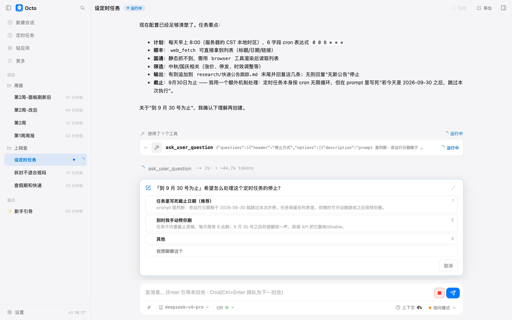
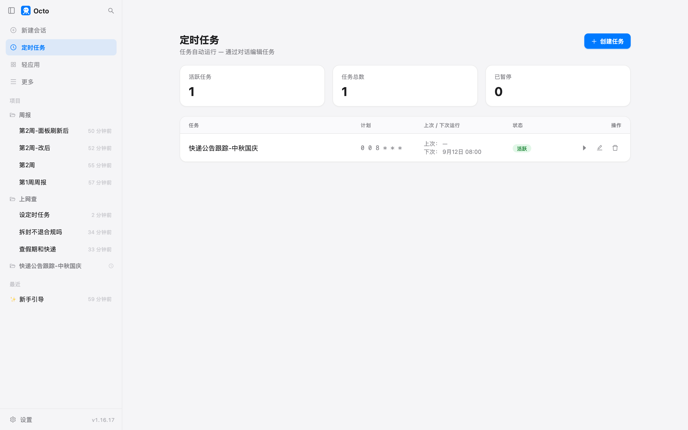
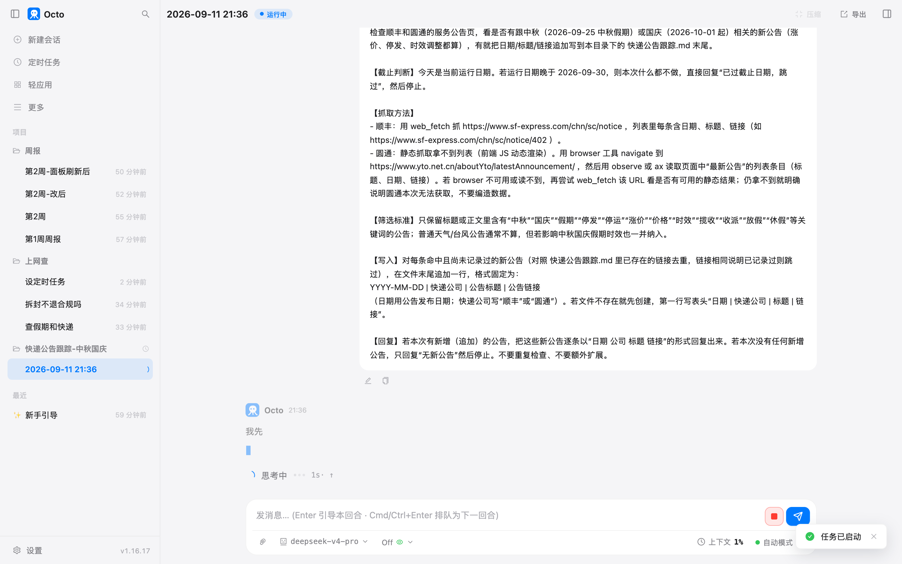
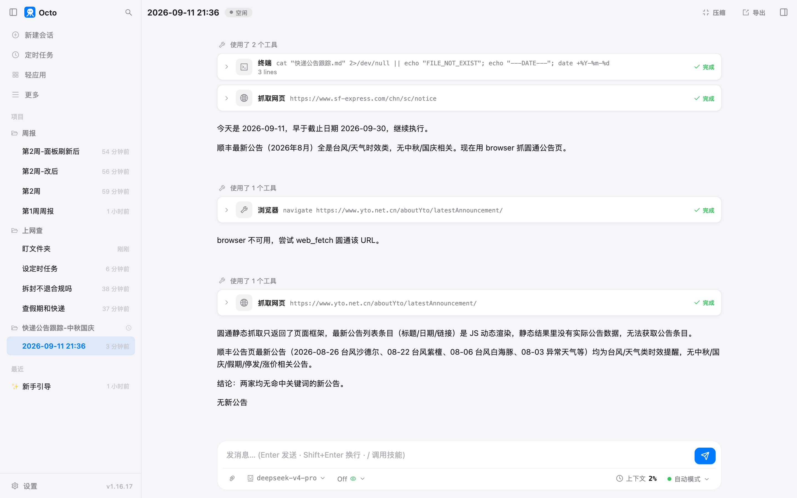
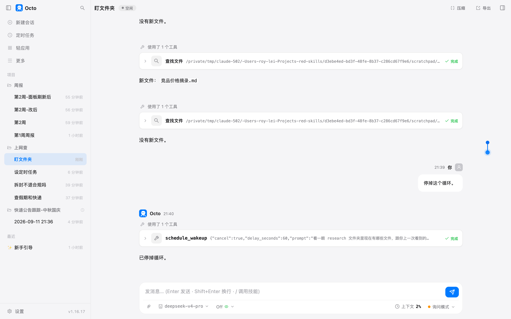

# 第 11 章 人不在也在跑

第 9 章末尾它自己提了一句：快递公司一般临近节日才发公告，要不要设个定时任务到点复查。
这一章接这句话。

"人不在"有两种。一种是天天到点就跑，你出差它也跑，这叫定时任务。
另一种是这场对话里盯一件事，每隔一会儿看一眼，看到了告诉你，对话关了就完，这叫循环。
两种都做一遍。

## 准备什么

octo 得一直开着。定时任务是 octo 后台服务里的一个闹钟，服务停了闹钟就停，
**错过的那一次不会在重启后补跑**。这一点意味着三点：

- 桌面应用关掉窗口默认不退出，留在菜单栏（Windows 是托盘）里继续跑。设置里有一个开关管这个，
  默认是开的。
- 命令行用户用 `octo serve -d` 让它在后台跑。
- 电脑合盖休眠，闹钟就不响。早上 8 点的任务要在早上 8 点开着电脑。

别的不用准备。上一章的项目"上网查"接着用。

## 设一个定时任务

> 上次查快递公告你说要不要设个定时任务到点复查，现在设一个。每天早上 8 点，查顺丰的服务公告页 https://www.sf-express.com/chn/sc/notice 和圆通的公告页 https://www.yto.net.cn/aboutYto/latestAnnouncement/ ，看有没有跟中秋、国庆有关的新公告（涨价、停发、时效调整都算）。有的话把日期、标题、链接追加写到 research 文件夹下的 快递公告跟踪.md 末尾一行，并把这几条回复给我；没有就回复"无新公告"然后停。到 9 月 30 号为止。

它加载了内置的 cron-task-creator 说明书，然后做了一件我没要求的事：**先把两个公告页各抓了一遍**，
看看到时候能不能抓到。顺丰能，圆通不能：

> 圆通：`web_fetch` 只拿到页面骨架，公告列表是 JS 动态渲染的，静态抓取拿不到条目。任务里需要提示用 `browser` 工具去抓圆通。

这一步值钱。定时任务是没人看着跑的，它在你面前先试一遍，比明天早上 8 点第一次跑才发现抓不到强。

然后弹了一张问题卡：

我选了写死截止日期。它建好任务，报告：

> **计划**：每天早上 8:00（服务器本地时区 CST），cron `0 0 8 * * *`
> **下次执行**：`2026-09-12 08:00`
> **截止**：prompt 里写死了截止判断，运行日期晚于 9 月 30 日就自动跳过并回复"已过截止日期"

那串 `0 0 8 * * *` 是闹钟的写法，六个位置分别是秒、分、时、日、月、星期。你不用会写，
它会翻译，你只要看它翻译回来的那句人话对不对："每天早上 8:00"。

**最短间隔是一小时。** 你说"每 10 分钟查一次"它会拒绝，因为定时任务是给"每天"、"每周"这种节奏用的，
十分钟一次的事用下面那个循环。每次运行最长 30 分钟，到点没干完就掐掉。

这一轮它实际干活大约 45 秒，五次权限框（试抓两个页面、建任务、核对任务列表）。

## 它替你写的那段话

定时任务到点跑的时候，是在一场**全新的对话**里跑的。它读不到你现在这场对话的任何内容，
只能看到任务里存的那段话。所以那段话必须自成一体。看看它替我写的（907 字，节选）：

> 检查顺丰和圆通的服务公告页，看是否有跟中秋（2026-09-25 中秋假期）或国庆（2026-10-01 起）相关的新公告……
>
> 【截止判断】今天是当前运行日期。若运行日期晚于 2026-09-30，则本次什么都不做，直接回复"已过截止日期，跳过"，然后停止。
>
> 【抓取方法】
> - 顺丰：用 web_fetch 抓 https://www.sf-express.com/chn/sc/notice ……
> - 圆通：静态抓取拿不到列表（前端 JS 动态渲染）。用 browser 工具 navigate 到……若 browser 不可用或读不到，再尝试 web_fetch 该 URL……仍拿不到就明确说明圆通本次无法获取，**不要编造数据**。
>
> 【筛选标准】只保留标题或正文里含有"中秋""国庆""假期""停发""停运""涨价""价格""时效""揽收""收派""放假""休假"等关键词的公告……
>
> 【写入】……在文件末尾追加一行，格式固定为：YYYY-MM-DD | 快递公司 | 公告标题 | 公告链接……若文件不存在就先创建，第一行写表头……
>
> 【回复】……若本次没有任何新增公告，只回复"无新公告"然后停止。**不要重复检查、不要额外扩展。**

我那一句话里的每个要素它都展开了，还补了三样我没说的：截止日期怎么判断、圆通抓不到怎么办、
文件不存在怎么办。最后那句"不要重复检查、不要额外扩展"是说明书里专门要求的：
一段没有明确停止条件的话，会让它在没人看着的时候一直"再确认一下"，直到 30 分钟被掐掉。

这段话你可以改。面板上每个任务右边有个编辑按钮，点了会开一场对话让它帮你改；
你也可以直接说"把快递公告那个任务改成每天 7 点"。

## 面板上的"立即运行"

侧栏"定时任务"：

明天早上 8 点太远了，右边第一个按钮是"立即运行"。点下去，界面直接跳到这次运行的对话：

注意三处：

- 侧栏多了一个项目，名字就是任务名，带一个小时钟。每次运行都是这个项目下的一场新对话，
  标题是运行的日期时间。以后每天一场，堆在这里。
- 对话开头贴的就是上一节那 907 字，它在没人看着的情况下读到的全部内容。
- 右下角写着**自动模式**。平时你的对话那里写的是"询问模式"。下一节说。

12 秒跑完：

它先看跟踪文件在不在、今天几号（判断截止），抓顺丰，最新一条还是 8 月 26 号的台风提醒；
按它自己写的方法用浏览器抓圆通，浏览器没接上（下一章的事），退回到直接抓，拿到的是骨架，
于是照它自己写的那句办："圆通静态抓取只返回了页面框架……无法获取公告条目"。最后一行："无新公告"。

没有编一条圆通的公告出来。那句"不要编造数据"是它自己写进去的，它自己守住了。

## 没人批权限怎么办

前十章每次写文件、跑命令，它都停下来问你。定时任务早上 8 点跑的时候没人在。所以定时任务的对话
开在**自动模式**：不问，直接做。这就是右下角那个词的意思。

规则是这样的：你在设置里没有明确指定权限模式的话，平时的对话是询问模式，定时任务的对话是自动模式。
你要是明确把全局设成了"询问"，定时任务也会照办，后果是每次写文件都在等一个不存在的人点确认，
超时之后按拒绝处理，任务跑完什么都没写。

所以定时任务里的那段话，就是它的全部约束。它能做什么、不能做什么、拿不到数据怎么办，
全靠那段话写清楚。"不要编造数据"这种句子在平时的对话里可以省，在定时任务里不能省。

## 在对话里盯着看：循环

另一种"人不在"：我在等一个同事把竞品价格表放进 research 文件夹，不想每隔一分钟自己去看。
新开一场对话：

> /loop 1m 看一眼 research 文件夹里现在有哪些文件，跟你上一次看到的比有没有新出现的文件。有就把新文件名告诉我；没有就只回复"没有新文件"，别做别的。

`/loop 1m` 的意思是每一分钟把后面那句话再说一遍。第一轮它列了文件夹（空的），回答"没有新文件"，
然后给自己定了一个 60 秒的闹钟，这一步弹了一次权限框。之后：

| 时间 | 它做了什么 | 回复 |
|---|---|---|
| 第 7 秒 | 列文件夹 | 没有新文件。 |
| 第 68 秒 | 列文件夹 | 没有新文件。 |
| 第 129 秒 | 列文件夹 | 新文件：`竞品价格摘录.md` |
| 第 189 秒 | 列文件夹 | 没有新文件。 |

第 2 轮和第 3 轮之间我把那个文件放了进去。第 4 轮它没有再报同一个文件，它记得上一轮看到过。

循环跑着的时候你可以照常跟它说话，不会被挡住。要停就说：

> 停掉这个循环。

几条边界：

- 间隔最短 60 秒，最长 1 小时。
- 带间隔的循环要你说停才停；不带间隔（`/loop 等构建变绿`）的循环它自己判断做完了就停。
- 任何循环跑满 12 小时自动停，兜底用的，别指望它。
- 循环活在这场对话里。关掉对话、重启 octo，循环就没了，不会像定时任务那样存下来。

## 两种怎么选

| | 定时任务 | 循环 |
|---|---|---|
| 节奏 | 一小时以上，每天每周 | 一分钟到一小时 |
| 活多久 | 一直，直到你删 | 这场对话，最多 12 小时 |
| 扛重启 | 是（服务开着就跑） | 否 |
| 谁在批权限 | 没人，自动模式 | 你，照常问 |
| 结果去哪 | 任务项目下每天一场新对话 | 就在这场对话里 |
| 适合 | 每天早上的复查、每周五的周报 | 等一个文件、盯一次上线 |

第 8 章那份周报说明书加上这一章的定时任务，就是"每周五早上自动出周报"。案例 B 会把它们接起来。

## 你要重点检查什么

- **建好之后第一步：点"立即运行"，把那场对话从头看一遍。** 它在你面前试抓过一次，但没人看着的那一次才是真的。
- **那段话里有没有"没有就停"。** 打开任务看它写的 prompt，找停止条件。没有的话让它加。
- **拿不到数据的时候它说什么。** 圆通那条就是例子。你要的是"本次无法获取"，怕的是编一条出来。
  这句话要写在任务里。
- **时区和时间。** 它报回来的"每天早上 8:00"按的是这台电脑的时区。出差换了时区，任务不跟着走。
- **8 点电脑开着没有。** 没开就没跑，也没人告诉你没跑。面板上"上次运行"那一栏是唯一的证据。

## 翻车点

**错过就是错过。** 电脑合盖、octo 没开、断网，那一次就没了，重启不补。面板上"上次运行"停在前天，
就说明昨天没跑。这一点没有提醒，你要自己看。第 12 章把结果推到手机上之后，"今天没收到"就是提醒。

**它写的方法到点不一定能用。** 它试抓过圆通、知道要用浏览器，也写进了任务。但定时任务跑的那一刻浏览器没接上，
它退了两步才收住。任务里写的每一条方法，都要有"不行怎么办"。这次是它自己写了，你不能指望每次都有。

**手改任务文件不生效。** 任务存在 `~/.octo/tasks/` 下的 JSON 文件里，服务开着的时候直接改文件，
它不会重新读，要等重启。要改就在面板上改，或者跟它说。

## 风险提醒

自动模式的意思是：那段话里让它做的事，它会直接做，写文件、跑命令都不再问你。所以定时任务的活要选那种
**做错了也能收回**的：查资料、写一份汇总、往一个文件末尾追加一行。删文件、发消息、改别人的文件，
这类活别放进定时任务里，至少别在第一周放。

每个任务有自己的目录（以任务名命名，在工作区下面），它写的文件默认落在那里。要它去动别处的文件，
在任务里写清路径，也让它只动那一处。

## 花了多少

| 活 | 时间 | token | 缓存命中 | 权限框 |
|---|---|---|---|---|
| 设定时任务（含它先试抓两个页面） | 约 45 秒（另加我看问题卡的时间） | 2.5 万 | 92% | 5 |
| 立即运行一次 | 12 秒 | 未记 | | 0（自动模式） |
| 循环 5 轮（含停掉） | 3 分 32 秒 | 2050 | 99% | 2 |

循环每一轮三四百 token，缓存命中 99%，因为每一轮说的是同一句话、看的是同一个文件夹。
一分钟一轮跑一天是一千四百多轮，五十来万 token，缓存价算下来几毛钱，但没有人会让它盯一天，
12 小时的上限在那里。

## 上册对照

上册练习 26 讲的是 loop：谁来触发下一轮。答案是模型自己调一个"闹钟"工具给自己排下一轮，
这一章的 `/loop` 就是那个练习的成品，连"取消"都是同一个工具。定时任务是另一条路，触发的是外面的调度器，
不是模型自己。

*最后核对：2026-09-11，octo 1.16.17。*

---
